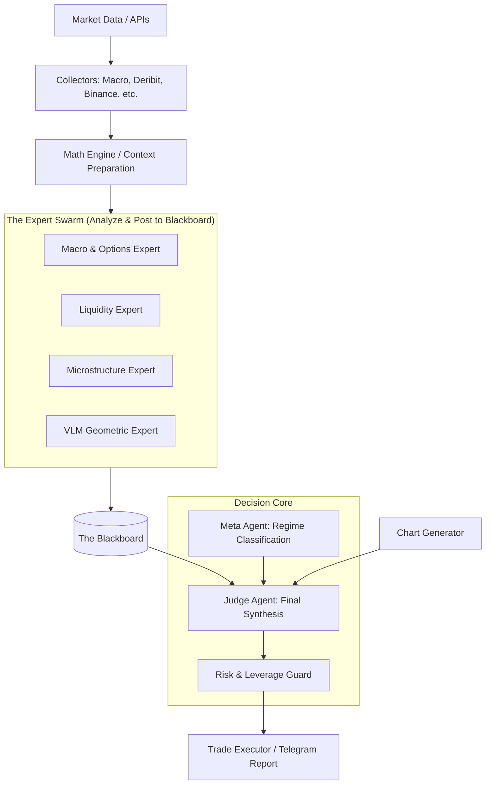

# 🤖 Finance Telegram Bot: Multi-Agent Swarm Architecture

This document describes the structure and roles of the 2026-gen Multi-Asset (BTC/ETH) Hybrid Intelligent Agent Swarm. Internal infrastructure details and API keys are omitted for security.

## 🏗️ Architecture: The Blackboard System

The system operates on a **"Blackboard Architecture"**. Independent expert agents analyze market data and post their findings to a shared "Blackboard." The **Judge Agent** then synthesizes these insights to make the final execution decision.

---

## 🎖️ Agent Roles & Responsibilities

### 1. The Decision Core

#### 👑 Judge Agent (Commander)
- **Model**: `Claude 4.6 Sonnet`
- **Role**: Synthesizes all expert opinions, chart images (VLM), and macro contexts to make the final `LONG / SHORT / HOLD / CANCEL` decision.
- **Key Logic**: Performs **Falsifiability Analysis** to identify the strongest evidence against its own bias before confirming a trade.

#### 🛡️ Meta Agent (Strategy Architect)
- **Model**: `Gemini 3.1 Pro`
- **Role**: Classifies the current Market Regime (Trending, Range-bound, Volatility Spike).
- **Impact**: Sets the **Trust Directives** (which expert to weigh more) and the **Risk Budget**.

#### ⚖️ Risk Manager Agent (CRO)
- **Model**: `Claude 4.6 Sonnet`
- **Role**: Holds final **Veto Power** over the Judge's draft decisions.
- **Impact**: Calculates sizing based on the Kelly Criterion and enforces a hard **2.0x total account leverage cap**.

---

### 2. Domain Expert Swarm

#### 📈 Macro & Options Expert (Institutional Sentiment)
- **Model**: `Gemini 3 Flash`
- **Signals**: CME Basis (BTC/ETH Premium), Deribit 25d Skew, DVOL, Macro Indicators (DXY, NASDAQ).
- **Specialty**: Tracks the "Hidden Footprints" of institutional players and OTC desks.

#### 🌊 Liquidity Expert (Supply & Demand)
- **Model**: `Gemini 3 Flash`
- **Signals**: CVD (Cumulative Volume Delta), Large Liquidations, Whale Buy/Sell Intensity.
- **Specialty**: Identifies supply/demand imbalances and heavy accumulation/distribution phases.

#### 🔬 Microstructure Expert (Orderflow Quality)
- **Model**: `Gemini 3 Flash`
- **Signals**: Bid/Ask Spread, Orderbook Imbalance, Real-time Slippage.
- **Specialty**: Measures "Orderbook Fragility" to determine if a move is technically sound or just a "liquidity grab."

#### 👁️ VLM Geometric Expert (Visual Analysis)
- **Model**: `Gemini 3.1 Pro (Multimodal)`
- **Input**: High-resolution technical analysis charts.
- **Specialty**: Recognizes geometric patterns, trendlines, and structural "shapes" like a human senior trader.

---

## 🧠 Conviction Hierarchy
When expert opinions conflict, the system resolves deadlocks using these priority rules:

1. **Short-term (Scalp/Swing entry)**: Microstructure > Liquidity > Macro > Visual Geometry
2. **Medium/Long-term (Swing/Position)**: Macro/Options > Liquidity > Visual Geometry > Microstructure

---
*Last Updated: 2026-03-01*
