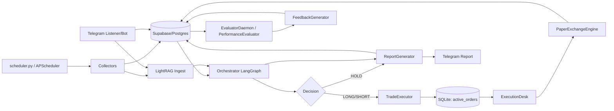

# Finance Telegram Bot Architecture (Code-Accurate)

Last updated: 2026-03-09 (Current Milestone: V14.1)
Scope: based on current implementation in `scheduler.py`, `executors/`, `agents/`, `collectors/`, `evaluators/`, `processors/`, `config/`, `bot/`.

## 1. Purpose

This system runs an automated crypto analysis and execution pipeline for `TRADING_SYMBOLS` (default: `BTCUSDT`, `ETHUSDT`), with:

- continuous data collection,
- scheduled AI analysis (daily precision + hourly monitor),
- trade intent generation and execution (paper-first),
- report delivery to Telegram,
- post-trade evaluation and feedback loop.

This document is the canonical maintenance reference for architecture-level changes.

## 2. Runtime Topology

Primary process:

- `scheduler.py` is the runtime entrypoint.

Threads/services started by scheduler:

- APScheduler background jobs (`config/scheduler_config.py`).
- Telegram command bot thread (`bot/telegram_bot.py`).
- Real-time Telegram listener thread (`collectors/telegram_listener.py`).
- Binance WebSocket collector thread (`collectors/websocket_collector.py`).

Data/control planes:

- Hot operational data: Supabase/Postgres (`config/database.py`).
- Fast local state: SQLite (`config/local_state.py`, `data/local_state.db`).
- Knowledge layer: LightRAG (`processors/light_rag.py`) with Neo4j/Milvus or in-memory fallback.
- Optional archive: GCS Parquet (`processors/gcs_parquet.py`, `processors/gcs_archive.py`).

## 3. End-to-End Flow

### 3.0 Data Workflow Diagram


```mermaid
flowchart LR
    S[scheduler.py / APScheduler] --> C[Collectors]
    C --> DB[(Supabase/Postgres)]
    C --> LR[LightRAG Ingest]
    TL[Telegram Listener/Bot] --> DB
    TL --> LR

    DB --> O[Orchestrator LangGraph]
    LR --> O
    O --> D{Decision}
    D -->|LONG/SHORT| TE[TradeExecutor]
    D -->|HOLD| RG[ReportGenerator]

    TE --> SQ[(SQLite: active_orders)]
    SQ --> ED[ExecutionDesk]
    ED --> PE[PaperExchangeEngine]
    PE --> DB

    O --> RG
    RG --> TGM[Telegram Report]
    RG --> DB

    DB --> EV[EvaluatorDaemon / PerformanceEvaluator]
    EV --> FB[FeedbackGenerator]
    FB --> DB
```

### 3.1 Collection and context build

Scheduled collectors write market and context signals into Supabase:

- price/candles/CVD, funding+OI, microstructure, liquidations, macro, options, fear-greed, Telegram messages, Dune snapshots, narrative data, on-chain daily snapshots.

Additional system-generated market telemetry:

- `job_routine_market_status` writes hourly `market_status_events` with technical snapshots, realtime pressure summary, on-chain overlay, and selected news.
- `job_pressure_signal_evaluation` later backfills forward-return evaluation into those stored `market_status_events`.

### 3.2 Analysis graph (Orchestrator)

`executors/orchestrator.py` builds a LangGraph pipeline:

`collect_data -> context_gathering -> meta_agent -> triage -> generate_chart -> rule_based_chart -> vlm_expert -> judge_agent -> risk_manager -> portfolio_leverage_guard -> execute_trade -> generate_report -> data_synthesis`

Key behaviors:

- deterministic triage before expensive VLM calls,
- regime classification before judge decision,
- CRO-style risk override after judge decision,
- execution-intent registration and later order processing,
- Telegram report + evaluation logs.
- daily playbook persistence is handled by `node_generate_playbook(...)` after `run_daily_playbook()` completes; it is not a LangGraph node.

### 3.3 Execution path

- `TradeExecutor.execute_from_decision()` registers intents in local SQLite.
- `ExecutionDesk.process_intents()` runs every minute and fills chunks by strategy (`MOMENTUM_SNIPER`, `SMART_DCA`, etc.).
- `PaperExchangeEngine` tracks positions, TP/SL, liquidations, and funding fee simulation.

### 3.4 Evaluation loop

- `node_generate_report` upserts `evaluation_predictions` and `evaluation_component_scores` for each AI report.
- `PerformanceEvaluator` computes fixed-horizon outcomes and upserts `evaluation_outcomes`.
- `FeedbackGenerator` consumes delayed evaluations and stores corrective lessons in `feedback_logs`.
- `EvaluationRollupService` aggregates daily system/component metrics into `evaluation_rollups_daily`.
- `job_pressure_signal_evaluation` converts hourly `market_status_events.realtime_pressure` signals into the same evaluation tables (`mode=realtime_pressure`).
- `EvaluatorDaemon` remains a separate TP/SL watcher that writes post-mortem memory and JSONL resolution logs.

## 4. Scheduler Job Map

Defined in `scheduler.py`.

- every 1m: `job_1min_tick` (price, funding, microstructure, volatility)
- every 1m: `job_1min_execution` (intent processing, paper TP/SL, liquidation checks)
- every 5m: websocket thread health check / auto-restart
- every 15m: `job_15min_dune`
- every 15m: `job_pressure_signal_evaluation`
- hourly at :00: `job_1hour_deribit`
- hourly at :05: `job_1hour_telegram` (batch + triangulation worker)
- hourly at :10: `job_1hour_crypto_news`
- hourly at :15: `job_hourly_monitor` (daily playbook checks)
- hourly at :20: `job_routine_market_status` (summary + Telegram push)
- hourly at :22: `job_hourly_swing_charts` (BTC/ETH swing chart push)
- hourly at :45: `job_1hour_evaluation`
- daily 00:00 UTC: `job_daily_precision` (daily playbook generation)
- daily 00:12 UTC: `job_daily_coinmetrics`
- daily 00:15 UTC: `job_daily_fear_greed`
- daily 00:30 UTC: `job_24hour_evaluation`
- daily 00:40 UTC: `job_daily_evaluation_rollup`
- daily 01:00 UTC: `job_daily_archive_to_gcs`
- daily 01:20 UTC: `job_daily_safe_cleanup` (archive-verified deletion + LightRAG cleanup)
- every 8h (paper mode): funding fee simulation

Notes:

- `job_daily_precision` explicitly refreshes Coin Metrics and macro context before `orchestrator.run_daily_playbook()`.
- startup bootstrap also runs immediate initial collectors plus delayed Telegram catch-up synthesis.

## 5. Agents Layer (Current Wiring)

### 5.1 Active in production flow

- `agents/meta_agent.py` (`meta_agent`):
  - classifies regime (`BULL_MOMENTUM`, `BEAR_MOMENTUM`, etc.),
  - outputs trust/risk directives consumed downstream.

- `agents/vlm_geometric_agent.py` (`vlm_geometric_agent`):
  - chart image reasoning, conditionally invoked by triage/rule gates.

- `agents/judge_agent.py` (`judge_agent`):
  - final decision draft (`LONG/SHORT/HOLD/CANCEL_AND_CLOSE`),
  - produces playbook structures used by hourly monitor.

- `agents/risk_manager_agent.py` (`risk_manager_agent`):
  - CRO override on size/leverage/venue and veto logic.

- `agents/market_monitor_agent.py` (`market_monitor_agent`):
  - hourly deterministic playbook evaluator (`NO_ACTION/WATCH/SOFT_TRIGGER/TRIGGER`),
  - applies on-chain/policy downgrade logic and optional low-cost `trigger_veto`,
  - also generates routine status summary text.

- `agents/ai_router.py` (`ai_client`):
  - role-based model router (Gemini/Cerebras/Groq/OpenRouter/Cloudflare),
  - fallback and circuit-breaking behavior.

### 5.2 Called inside orchestrator triage (not separate LangGraph nodes)

- `agents/liquidity_agent.py`
- `agents/microstructure_agent.py`
- `agents/macro_options_agent.py`

These modules are invoked inside `node_triage` as deterministic/heuristic analyzers.
They are not registered as independent LangGraph nodes.

### 5.3 Role-Model-Tool Matrix (Current Config)

| Role key (`ai_router`) | Main caller(s) | Core responsibility | Routed backend/model (current `settings`) | Main tools/data used |
|---|---|---|---|---|
| `judge` | `agents/judge_agent.py` | Final decision (`LONG/SHORT/HOLD/CANCEL_AND_CLOSE`) + playbook generation | Gemini judge: `MODEL_JUDGE=gemini-3.1-pro-preview` (fallback `MODEL_JUDGE_FALLBACK=gemini-3-flash-preview`) | Blackboard synthesis, optional chart image, prior decision lookup, episodic memory retrieval (`executors/post_mortem.py` + LightRAG) |
| `vlm_geometric` | `agents/vlm_geometric_agent.py` | Visual chart reasoning to structured JSON | Gemini VLM: `MODEL_VLM_GEOMETRIC=gemini-3-flash-preview` | `processors/chart_generator.py` output image (`chart_image_b64`) |
| `meta_regime` | `agents/meta_agent.py` | Regime classification + trust/risk directive | Cerebras: `MODEL_META_REGIME=gpt-oss-120b` | Market compact data, derivatives, macro, RAG context, Telegram news |
| `risk_eval` | `agents/risk_manager_agent.py` | CRO override on size/leverage/venue + veto | Cerebras: `MODEL_RISK_EVAL=gpt-oss-120b` (fallback route to Groq pool including `MODEL_RISK_EVAL_FALLBACK=openai/gpt-oss-20b`) | Judge draft decision, funding/deribit contexts, deterministic venue hard rules |
| `monitor_hourly` | `agents/market_monitor_agent.py` (`summarize_current_status`) | Routine market summary text | Cerebras: `MODEL_MONITOR_HOURLY=gpt-oss-120b` | Hourly indicator snapshot (price/funding/OI divergence/MFI proxy) |
| `trigger_veto` | `agents/market_monitor_agent.py` (`lightweight_veto_check`) | Cheap contextual veto/reduce layer after deterministic `TRIGGER` | Groq: `MODEL_TRIGGER_VETO=llama3.1-8b` | Trigger payload, recent Telegram news, on-chain gate, policy snapshot |
| `rag_extraction` | `processors/light_rag.py`, `processors/telegram_batcher.py` | Entity/relationship extraction + Telegram batch summarization | Groq: `MODEL_RAG_EXTRACTION=openai/gpt-oss-20b` | LightRAG ingest/query pipeline, Telegram chunk synthesis |
| `vlm_telegram_chart` | `collectors/telegram_listener.py` | Chart-caption/image understanding for visual Telegram channels | Gemini VLM: `MODEL_VLM_TELEGRAM_CHART=gemini-3-flash-preview` | Telegram image bytes + cleaned caption text |
| `self_correction` | `evaluators/feedback_generator.py` | Wrong-call feedback and lessons learned | Gemini judge route: `MODEL_SELF_CORRECTION=gemini-3.1-pro-preview` | Evaluation results + original reasoning/execution notes |
| `macro` | `executors/post_mortem.py` | Post-trade case-study style lesson generation | Cerebras route (mapped to `MODEL_META_REGIME=gpt-oss-120b`) | Trade context + outcome analysis for memory loop |
| `news_cluster` | `scheduler.py` (job_routine_market_status) | Selecting and merging high-impact news | Groq: `MODEL_NEWS_CLUSTER=qwen/qwen3-32b` | Telegram + External news inputs, JSON-schema grouping |
| `news_brief_final` | `scheduler.py` (job_routine_market_status) | Writing concise Korean market briefings | Groq: `MODEL_NEWS_FINAL=openai/gpt-oss-120b` (fallback `MODEL_NEWS_FINAL_FALLBACK=openai/gpt-oss-20b`) | Selected news items from cluster step |
| `news_summarize` | `agents/market_monitor_agent.py` | Fallback market status summary generation | Groq route: `MODEL_NEWS_SUMMARIZE=llama3.1-8b` | Current market indicators (price/funding/etc.) |

Notes:

- `MarketMonitorAgent.evaluate()` is deterministic rule evaluation against playbook conditions (no LLM call).
- `MarketMonitorAgent.lightweight_veto_check()` is a separate post-trigger LLM pass and only runs after deterministic `TRIGGER`.
- Router supports additional roles (`news_summarize`, `cloudflare_triage`, `cloudflare_rerank`, `chat`, etc.), but the table above lists the roles actively used in current runtime paths.

### 5.4 Model Routing and Failover

- Critical roles (`judge`, `risk_eval`, `meta_regime`, `self_correction`) are treated as high-priority in `agents/ai_router.py`.
- Gemini critical path: primary model failure -> judge fallback model -> relay providers (Cerebras/Groq) depending on role and availability.
- Groq/Cerebras/OpenRouter routes use circuit-breaker cooldown when rate-limited.
- Cloudflare Workers AI is used for low-cost triage/rerank style tasks (`MODEL_CF_TRIAGE`, `MODEL_CF_RERANK`) in LightRAG-related flows.

### 5.5 Role I/O Schemas (Code-Level Contracts)

#### A) `judge` (`agents/judge_agent.py`)

Input (caller-side):

- `market_data_compact: str`
- `blackboard: Dict[str, dict]`
- `funding_context: str`
- `chart_image_b64: Optional[str]`
- `mode: TradingMode`
- `feedback_text: str`
- `active_orders: list`
- `open_positions: str`
- `symbol: str`
- `regime_context: Optional[Dict]`
- `narrative_context: str`

Output (normalized JSON contract):

```json
{
  "decision": "LONG|SHORT|HOLD|CANCEL_AND_CLOSE",
  "allocation_pct": 0,
  "leverage": 1,
  "entry_price": null,
  "stop_loss": null,
  "take_profit": null,
  "hold_duration": "N/A",
  "reasoning": {
    "counter_scenario": "string",
    "meta_agent_context": "string",
    "technical": "string",
    "derivatives": "string",
    "experts": "string",
    "narrative": "string",
    "final_logic": "string"
  },
  "win_probability_pct": 0,
  "expected_profit_pct": 0.0,
  "expected_loss_pct": 0.0,
  "ev_rationale": "string",
  "key_factors": [],
  "monitoring_playbook": {
    "entry_conditions": [],
    "invalidation_conditions": []
  },
  "daily_dual_plan": {
    "swing_plan": {"entry_conditions": [], "invalidation_conditions": []},
    "position_plan": {"entry_conditions": [], "invalidation_conditions": []}
  }
}
```

Parsing/guardrails:

- Outermost JSON extraction with bracket-depth parsing.
- `monitoring_playbook` and `daily_dual_plan.*` are always normalized to list-based condition arrays.
- Any parse/runtime failure falls back to safe `HOLD` default schema.

#### B) `meta_regime` (`agents/meta_agent.py`)

Input:

- `market_data_compact`, `deribit_context`, `funding_context`, `macro_context`
- optional `rag_context`, `telegram_news`, `mode`

Output JSON:

```json
{
  "regime": "BULL_MOMENTUM|BEAR_MOMENTUM|RANGE_BOUND|VOLATILITY_PANIC|SIDEWAYS_ACCUMULATION",
  "rationale": "string",
  "trust_directive": "string",
  "risk_budget_pct": 50,
  "risk_bias": "AGGRESSIVE|NEUTRAL|CONSERVATIVE"
}
```

Failure fallback: fixed neutral regime payload (`RANGE_BOUND`, `risk_budget_pct=50`).

#### C) `vlm_geometric` (`agents/vlm_geometric_agent.py`)

Input:

- `chart_image_b64: str` (required for useful output)
- optional `mode`, `symbol`, `current_price`

Output JSON:

```json
{
  "anomaly": "geometric_trap|fake_breakout|exhaustion_top|capitulation_bottom|clean_breakout|accumulation_range|none",
  "directional_bias": "BULLISH|BEARISH|NEUTRAL",
  "confidence": 0.0,
  "key_levels": {
    "nearest_order_block": null,
    "nearest_unmitigated_fvg": null,
    "liquidation_pool_above": null,
    "liquidation_pool_below": null,
    "volume_poc": null
  },
  "fibonacci_context": {
    "test_level": "unknown",
    "anchor_high": null,
    "anchor_low": null,
    "confluence": "string"
  },
  "pattern": "H&S|inv_H&S|double_top|double_bottom|bull_flag|bear_flag|ascending_triangle|wedge|none|other",
  "cvd_signal": "divergence_bullish|divergence_bearish|confirming|neutral",
  "rationale": "string"
}
```

Failure fallback: deterministic neutral JSON (`anomaly=none`, `confidence=0`).

#### D) `risk_eval` (`agents/risk_manager_agent.py`)

Input:

- `draft_decision: dict` (Judge draft)
- `funding_context: str`
- `deribit_context: str`
- `mode: TradingMode`

LLM expected output (internal):

```json
{
  "decision": "LONG|SHORT|HOLD",
  "approved_allocation_pct": 0,
  "approved_leverage": 1,
  "target_exchange": "BINANCE|UPBIT|SPLIT",
  "recommended_execution_style": "PASSIVE_MAKER|SMART_DCA|MOMENTUM_SNIPER|CASINO_EXIT",
  "cro_veto_applied": false,
  "cro_reasoning": "string"
}
```

Final returned object (after merge/overrides):

- Based on original `draft_decision` + CRO fields merged.
- Enforces hard constraints (e.g., veto -> `HOLD`, Upbit no short/no leverage, position-mode short blocked).
- On error, returns safe hold object with zero sizing.

#### E) `monitor_hourly` (`agents/market_monitor_agent.py`)

Two outputs exist:

1. Deterministic evaluator (`evaluate`) return schema:

```json
{
  "status": "NO_ACTION|WATCH|SOFT_TRIGGER|TRIGGER",
  "symbol": "BTCUSDT",
  "mode": "swing|position",
  "matched_conditions": [],
  "unmatched_conditions": [],
  "invalidated": false,
  "reasoning": "string",
  "live_indicators": {},
  "scenario_snapshot": {},
  "trap_state": "none",
  "revision_state": "stable",
  "playbook_id": 0,
  "match_ratio": 0.0,
  "policy_checks": {},
  "onchain_gate": {}
}
```

2. LLM summary (`summarize_current_status`) return type:

- `str` (HTML-formatted short market summary for Telegram/routine status push).

3. Low-cost veto (`lightweight_veto_check`) return schema:

```json
{
  "action": "PASS|VETO|REDUCE",
  "reason": "string",
  "risk_flags": []
}
```

#### F) `rag_extraction` (`processors/light_rag.py`, `processors/telegram_batcher.py`)

Used in two patterns:

1. LightRAG entity extraction expected JSON:

```json
{
  "entities": [
    {"name": "entity_name", "type": "person|org|coin|event|indicator|exchange", "description": "brief description"}
  ],
  "relationships": [
    {"source": "entity1", "target": "entity2", "type": "relationship_type", "description": "brief explanation"}
  ]
}
```

2. Telegram batch synthesis expected output:

- Dense summary text paragraph (category-specific).
- For `BREAKING_FILTER`, sentinel `NO_BTC_ETH_SIGNAL` means skip ingest.

#### G) `self_correction` (`evaluators/feedback_generator.py`)

Input:

- `evaluation` dict (predicted vs actual direction, price change, prior reasoning, execution note)

Role output type:

- `str` (mistake analysis lesson text from LLM)

Persisted feedback record schema:

```json
{
  "symbol": "BTCUSDT",
  "prediction_time": "iso8601",
  "predicted_direction": "LONG|SHORT|HOLD",
  "actual_direction": "UP|DOWN|FLAT",
  "actual_change_pct": 0.0,
  "mistake_summary": "string",
  "lesson_learned": "string",
  "created_at": "iso8601"
}
```

## 6. Collectors Layer

### 6.1 Market and derivatives collectors

- `collectors/price_collector.py` (`collector`)
  - Binance futures + Upbit spot OHLCV,
  - computes `volume_delta` and writes `market_data` + `cvd_data`.

- `collectors/funding_collector.py` (`funding_collector`)
  - funding rate, global OI components, long/short ratio, basis,
  - writes `funding_data`.

- `collectors/microstructure_collector.py` (`microstructure_collector`)
  - spread, top-book imbalance, slippage proxy,
  - writes `microstructure_data`.

- `collectors/websocket_collector.py` (`websocket_collector`)
  - Binance force liquidations + whale trades in real time,
  - writes `liquidations` and whale fields into `cvd_data`,
  - also feeds real-time price to paper engine.

- `collectors/volatility_monitor.py` (`volatility_monitor`)
  - detects spikes and can trigger emergency swing analysis.

### 6.2 Macro/options/sentiment/on-chain

- `collectors/macro_collector.py` (`macro_collector`)
  - FRED + yfinance macro snapshot, including CME basis fields,
  - writes `macro_data`.

- `collectors/deribit_collector.py` (`deribit_collector`)
  - DVOL, PCR, IV term structure, 25d skew,
  - writes `deribit_data`.

- `collectors/fear_greed_collector.py` (`fear_greed_collector`)
  - alternative.me index,
  - writes `fear_greed_data`.

- `collectors/coinmetrics_collector.py` (`coinmetrics_collector`)
  - Coin Metrics daily timeseries pull + deterministic on-chain scoring,
  - writes `onchain_daily_snapshots`.

- `collectors/dune_collector.py` (`dune_collector`)
  - cadence-aware Dune query runner with stale-result fallback and budget guards,
  - sanitizes and writes `dune_query_results`.

### 6.3 Narrative and Telegram intelligence

- `collectors/perplexity_collector.py` (`perplexity_collector`)
  - web-searched narrative synthesis, stores to `narrative_data`,
  - used in orchestrator context gathering and LightRAG ingest.

- `collectors/crypto_news_collector.py` (`collector`)
  - free crypto news fetch + LightRAG ingest.

- `collectors/telegram_listener.py` (`telegram_listener`)
  - real-time Telethon listener + startup backfill,
  - sanitizes text, saves Telegram messages, runs triage-triggered extraction, and optional chart-image VLM extraction.

- `collectors/telegram_collector.py` (`telegram_collector`)
  - legacy batch-style Telegram collector utilities still present.

- auxiliary search providers:
  - `collectors/serper_collector.py`
  - `collectors/tavily_collector.py`
  - `collectors/exa_collector.py`

### 6.4 Collector I/O Contracts (Scheduler-Facing)

Entry-point contract convention (most collectors):

- Input: none (collector reads config + external APIs internally)
- Output: `None` return
- Side effects: write/upsert to DB and/or ingest to LightRAG

Key runtime collectors:

1. `collectors/price_collector.py` -> `collector.run()`
Input: none
Output: `None`
Internal output shape (`collect_all_prices`) example:
```json
{
  "timestamp": "iso8601",
  "symbol": "BTCUSDT",
  "exchange": "binance|upbit",
  "open": 0.0,
  "high": 0.0,
  "low": 0.0,
  "close": 0.0,
  "volume": 0.0,
  "taker_buy_volume": 0.0,
  "taker_sell_volume": 0.0,
  "volume_delta": 0.0
}
```
DB side effects: `market_data` batch insert, `cvd_data` upsert.

2. `collectors/funding_collector.py` -> `funding_collector.run()`
Input: none
Output: `None`
Internal output shape (`collect_all_funding_data`) example:
```json
{
  "symbol": "BTCUSDT",
  "timestamp": "iso8601",
  "funding_rate": 0.0,
  "next_funding_time": 0,
  "open_interest": 0.0,
  "open_interest_value": 0.0,
  "oi_binance": 0.0,
  "oi_bybit": 0.0,
  "oi_okx": 0.0,
  "basis_pct": 0.0,
  "long_short_ratio": 1.0,
  "long_account": 0.5,
  "short_account": 0.5
}
```
DB side effects: `funding_data` upsert.

3. `collectors/microstructure_collector.py` -> `microstructure_collector.run()`
Input: none
Output: `None`
Internal row schema:
```json
{
  "timestamp": "iso8601",
  "symbol": "BTCUSDT",
  "exchange": "binance",
  "bid_price": 0.0,
  "ask_price": 0.0,
  "spread_bps": 0.0,
  "bid_qty_top5": 0.0,
  "ask_qty_top5": 0.0,
  "orderbook_imbalance": 0.0,
  "slippage_buy_100k_bps": 0.0,
  "depth_levels": 5
}
```
DB side effects: `microstructure_data` batch upsert.

4. `collectors/macro_collector.py` -> `macro_collector.run()`
Input: none
Output: `None`
Internal payload keys (nullable): `dgs2`, `dgs10`, `cpiaucsl`, `fedfunds`, `dxy`, `nasdaq`, `gold`, `oil`, `btc_cme_basis`, `btc_cme_basis_pct`, `eth_cme_basis`, `eth_cme_basis_pct`, `ust_2s10s_spread`.
DB side effects: `macro_data` upsert.

5. `collectors/deribit_collector.py` -> `deribit_collector.run()`
Input: none
Output: `None`
Per-currency record schema:
```json
{
  "symbol": "BTC|ETH",
  "timestamp": "iso8601",
  "dvol": 0.0,
  "spot_price": 0.0,
  "pcr_oi": 0.0,
  "pcr_vol": 0.0,
  "iv_1w": 0.0,
  "iv_2w": 0.0,
  "iv_1m": 0.0,
  "iv_3m": 0.0,
  "iv_6m": 0.0,
  "term_inverted": false,
  "skew_1w": 0.0,
  "skew_2w": 0.0,
  "skew_1m": 0.0,
  "skew_3m": 0.0
}
```
DB side effects: `deribit_data` upsert.

6. `collectors/fear_greed_collector.py` -> `fear_greed_collector.run()`
Input: none
Output: `None`
Internal payload schema:
```json
{
  "timestamp": "iso8601 (daily midnight UTC)",
  "value": 0,
  "classification": "string",
  "value_prev": 0,
  "classification_prev": "string",
  "change": 0
}
```
DB side effects: `fear_greed_data` upsert.

7. `collectors/websocket_collector.py` -> `websocket_collector.start_background()`
Input: none
Output: `None` (background thread)
Stream outputs (buffered, 60s flush):
- Liquidation aggregate rows -> `liquidations`
- Whale aggregate rows -> `cvd_data` whale fields (`whale_buy_vol`, `whale_sell_vol`, counts)
- Real-time price callback to `paper_engine.handle_realtime_price(symbol, price)`

8. `collectors/telegram_listener.py` -> `telegram_listener.start()` / `run_backfill(hours)`
Input: `hours` for backfill
Output: async `None`
Side effects:
- upsert `telegram_messages`
- triage-triggered extraction + LightRAG ingest
- optional chart-caption VLM extraction for visual channels

9. `collectors/crypto_news_collector.py` -> `collector.fetch_and_ingest(...)`
Input: categories list
Output: `None`
Side effects: deduped article block ingestion to LightRAG (`channel="CRYPTO_NEWS_API"`).

10. `collectors/coinmetrics_collector.py` -> `coinmetrics_collector.run()`
Input: none
Output: `Dict[str, Dict]`
Internal snapshot keys include: `symbol`, `as_of_date`, `risk_bias`, `bias_score`, `valuation_state`, `flow_state`, `activity_state`, `structure_state`, `data_quality`, `regime_flags`, `raw_metrics`, `gate`.
DB side effects: `onchain_daily_snapshots` upsert.

## 7. Processors Layer

- `processors/math_engine.py` (`math_engine`):
  indicator and structure analysis.

- `processors/chart_generator.py` (`chart_generator`):
  chart generation for reporting and VLM context.

- `processors/light_rag.py` (`light_rag`):
  extraction, graph/vector storage, query formatting, triangulation worker.

- `processors/telegram_batcher.py` (`telegram_batcher`):
  category-based summarization and LightRAG ingestion from raw Telegram messages.

- `processors/onchain_signal_engine.py` (`onchain_signal_engine`):
  deterministic daily on-chain snapshot scoring, agent context formatting, and risk gate generation.

- `processors/flow_confirm_engine.py` (`flow_confirm_engine`):
  deterministic flow confirmation from funding/CVD/liquidation alignment for policy gating.

- `processors/gcs_parquet.py` (`gcs_parquet_store`):
  long-term archive/read path for OHLCV and related timeseries.

- `processors/gcs_archive.py` (`gcs_archive_exporter`):
  wrapper used by scheduler daily cleanup.

- `processors/cvd_normalizer.py`:
  legacy/utility CVD normalization helpers.

## 8. Executors Layer

- `executors/orchestrator.py` (`orchestrator`):
  central analysis and monitoring orchestrator.

- `executors/trade_executor.py` (`trade_executor`):
  decision-to-intent bridge and exchange execution abstraction.

- `executors/order_manager.py` (`execution_desk`):
  minute-by-minute intent processing and chunk fills.

- `executors/policy_engine.py` (`policy_engine`):
  deterministic structure/risk/flow gate applied before final execution and reused by hourly monitor re-checks.

- `executors/paper_exchange.py` (`paper_engine`):
  paper wallets/positions, TP/SL, liquidation, funding fees.

- `executors/report_generator.py` (`report_generator`):
  persist report + Telegram delivery.

- `executors/evaluator_daemon.py`:
  continuous post-trade closure evaluation.

- `executors/post_mortem.py`:
  episodic memory generation/retrieval helpers.

- `executors/metrics_logger.py` (`metrics_logger`):
  JSONL prediction/resolution logs.

- `executors/data_synthesizer.py`:
  training-data extraction from finished reports.

### 8.1 Executor I/O Contracts (Core Runtime)

1. `executors/orchestrator.py`
- `run_analysis(symbol, is_emergency=False, execute_trades=True) -> Dict`
- `run_analysis_with_mode(symbol, mode, is_emergency=False, execute_trades=True) -> Dict`
Returned contract: `final_decision` dict (Judge/CRO merged result, may include execution receipt).
Failure fallback: hold-like decision payload.

2. `executors/trade_executor.py`
- `execute_from_decision(final_decision: dict, mode: str, symbol: str) -> dict`
Output schema (success path):
```json
{
  "success": true,
  "receipts": [
    {
      "order_id": "uuid",
      "exchange": "BINANCE|UPBIT|BINANCE_SPOT",
      "side": "LONG|SHORT",
      "notional": 0.0,
      "paper": true,
      "note": "string"
    }
  ],
  "strategy_applied": "MOMENTUM_SNIPER|SMART_DCA|PASSIVE_MAKER|CASINO_EXIT",
  "total_notional": 0.0
}
```
Error path: `{"success": false, "note"|"error": "..."}`.

- `execute(symbol, side, amount, leverage=1, exchange='binance', style='SMART_DCA', tp_price=0.0, sl_price=0.0) -> Dict`
Output: paper/live fill result persisted to `trade_executions`.

3. `executors/order_manager.py` (`execution_desk`)
- `process_intents() -> None`
Input source: local SQLite `active_orders` (state manager).
Side effects:
- status transitions (`PENDING` -> `ACTIVE` -> filled/expired)
- chunked calls to `trade_executor.execute(...)`
- updates remaining amount and fill state

4. `executors/paper_exchange.py` (`paper_engine`)
- `simulate_execution(...) -> dict`
Success schema:
```json
{
  "success": true,
  "order_id": "uuid",
  "filled_price": 0.0,
  "size_coin": 0.0,
  "margin_used": 0.0,
  "slippage_applied_pct": 0.0
}
```
Main maintenance calls:
- `check_liquidations(current_prices: dict) -> None`
- `check_tp_sl(current_prices: dict) -> None`
- `apply_funding_fees(symbol_funding_rates: dict, current_prices: dict) -> None`
Side effects: `paper_positions`/`paper_wallets` state updates + Telegram notifications.

5. `executors/report_generator.py`
- `generate_report(...) -> Dict`
Output: stored report payload including `report_id` when DB insert succeeds.
- `notify(report, chart_bytes=None, mode=TradingMode.SWING) -> None`
Side effects: asynchronous Telegram message/photo delivery.

Related side effects from `node_generate_report(...)`:
- upsert `evaluation_predictions`
- upsert `evaluation_component_scores`
- append JSONL metrics via `metrics_logger`

6. `executors/evaluator_daemon.py`
- `evaluate_recent_trades() -> None`
Side effects:
- checks latest report TP/SL outcome conditions
- invokes post-mortem pipeline on failures
- writes resolution metrics via `metrics_logger`
- ingests post-mortem memory into LightRAG and local JSONL store

## 9. Evaluators Layer

- `evaluators/performance_evaluator.py` (`performance_evaluator`)
  - delayed report outcome scoring,
  - backfills/creates `evaluation_predictions` for `ai_reports`,
  - writes fixed-horizon `evaluation_outcomes`,
  - realized-volatility and drawdown-style metrics.

- `evaluators/feedback_generator.py` (`feedback_generator`)
  - LLM-generated mistake analysis for incorrect calls,
  - persistence to `feedback_logs`.

- `evaluators/evaluation_rollup.py` (`evaluation_rollup_service`)
  - daily aggregation over `evaluation_predictions`, `evaluation_outcomes`, `evaluation_component_scores`,
  - writes `evaluation_rollups_daily` for system- and component-level KPI tracking.

## 10. Data Stores and Key Tables

Supabase/Postgres (core operational tables):

- `market_data`
- `cvd_data`
- `funding_data`
- `liquidations`
- `microstructure_data`
- `macro_data`
- `deribit_data`
- `fear_greed_data`
- `telegram_messages`
- `narrative_data`
- `dune_query_results`
- `onchain_daily_snapshots`
- `daily_playbooks`
- `monitor_logs`
- `market_status_events`
- `ai_reports`
- `trade_executions`
- `feedback_logs`
- `evaluation_predictions`
- `evaluation_outcomes`
- `evaluation_component_scores`
- `evaluation_rollups_daily`
- `archive_manifests`

Local SQLite (`data/local_state.db`):

- `active_orders`
- `system_config`
- `paper_positions`
- `paper_wallets`

Local file stores:

- `data/eval_metrics/predictions.jsonl`
- `data/eval_metrics/resolutions.jsonl`
- `data/episodic_memory.jsonl`

Optional external stores:

- Neo4j (graph), Milvus/Zilliz (vectors), GCS Parquet archive.

## 11. Operations and Change Rules

When changing architecture, verify these integration boundaries first:

- scheduler job cadence and side effects,
- orchestrator graph node order and state keys,
- table schema compatibility for collectors and reports,
- Telegram command/tool interfaces,
- model-role routing in `agents/ai_router.py`.

Recommended update checklist for future contributors:

1. Update this file when node wiring, job cadence, or storage contracts change.
2. Confirm references by searching actual call sites, not file presence only.
3. Distinguish active path vs legacy modules explicitly.

## 12. Tooling Surface (MCP + Internal)

MCP server tools exposed in `mcp_server/server.py`:

- `analyze_market(symbol)`
- `get_news_summary(hours=4)`
- `get_funding_info(symbol)`
- `get_global_oi(symbol)`
- `get_cvd(symbol, minutes=240)`
- `search_narrative(symbol)`
- `query_knowledge_graph(query, mode="hybrid")`
- `get_latest_trading_report()`
- `get_current_position(symbol)`
- `execute_trade(symbol, side, amount, leverage=1)`
- `get_chart_image(symbol, lane="swing")`
- `get_chart_images(symbol, lane="swing")`
- `get_indicator_summary(symbol)`
- `get_trading_mode()`
- `get_feedback_history(limit=5)`

Notes:

- `search_narrative(symbol)` is currently exposed but intentionally blocked in the public MCP surface.
- `execute_trade(...)` is also safety-gated and only works when direct MCP trading is explicitly enabled in settings.

Key internal tooling blocks:

- Orchestration: `executors/orchestrator.py` (LangGraph workflow + node routing).
- Charts: `processors/chart_generator.py`.
- Knowledge/RAG: `processors/light_rag.py` (Neo4j/Milvus/in-memory fallback).
- Telegram intelligence: `collectors/telegram_listener.py`, `processors/telegram_batcher.py`.
- Execution engine: `executors/trade_executor.py`, `executors/order_manager.py`, `executors/paper_exchange.py`.
- Evaluation loop: `evaluators/performance_evaluator.py`, `evaluators/feedback_generator.py`, `executors/post_mortem.py`.
