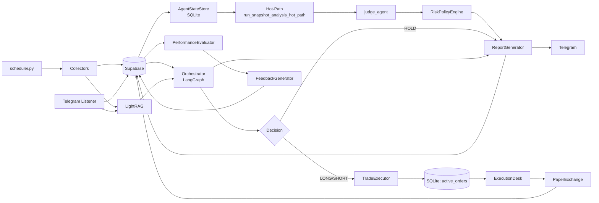

# Finance Telegram Bot — Architecture Reference

Last updated: 2026-03-19 (Milestone: V14.x)
Scope: `scheduler.py`, `executors/`, `agents/`, `collectors/`, `evaluators/`, `processors/`, `config/`, `bot/`, `liquidation_cascade/`

> **사용 목적**: 코드 위치를 빠르게 찾기 위한 레퍼런스.
> 기능·파일을 찾을 때 섹션 번호를 먼저 보고 해당 파일로 이동하면 됩니다.

---

## 목차

1. [시스템 개요](#1-시스템-개요)
2. [런타임 토폴로지](#2-런타임-토폴로지)
3. [데이터 레이어 (Supabase / GCS / SQLite)](#3-데이터-레이어)
4. [스케줄러 잡 맵](#4-스케줄러-잡-맵)
5. [오케스트레이터 (LangGraph 파이프라인)](#5-오케스트레이터)
6. [스냅샷 핫패스 (Hot-Path)](#6-스냅샷-핫패스)
7. [에이전트 레이어](#7-에이전트-레이어)
8. [컬렉터 레이어](#8-컬렉터-레이어)
9. [프로세서 레이어](#9-프로세서-레이어)
10. [익스큐터 레이어](#10-익스큐터-레이어)
11. [이벨류에이터 레이어](#11-이벨류에이터-레이어)
12. [리퀴데이션 캐스케이드 (ML)](#12-리퀴데이션-캐스케이드)
13. [텔레그램 봇](#13-텔레그램-봇)
14. [DB 테이블 전체 목록](#14-db-테이블-전체-목록)
15. [MCP 서버 툴](#15-mcp-서버-툴)
16. [설정 (settings.py) 핵심 파라미터](#16-설정-핵심-파라미터)

---

## 1. 시스템 개요

BTC/ETH 자동 분석·실행 봇.

| 구성요소 | 한 줄 설명 |
|---------|-----------|
| 심볼 | `BTCUSDT`, `ETHUSDT` (settings.TRADING_SYMBOLS) |
| 트레이딩 모드 | `swing` (6개월 룩백, 4h 분석) / `position` (4년 룩백, 1d 분석) |
| 데이터 수집 | 1분봉·파생상품·온체인·텔레그램 실시간 |
| AI 분석 | Meta → Judge → Risk (LangGraph) |
| 실행 | Paper-first, Binance Futures / Upbit Spot |
| 평가 루프 | PerformanceEvaluator → FeedbackGenerator |

---

## 2. 런타임 토폴로지

```
scheduler.py (APScheduler)
├── 텔레그램 봇 스레드          bot/telegram_bot.py
├── 텔레그램 리스너 스레드       collectors/telegram_listener.py
└── Binance WebSocket 스레드   collectors/websocket_collector.py
```


```mermaid
flowchart LR
    S[scheduler.py] --> C[Collectors]
    C --> DB[(Supabase)]
    C --> LR[LightRAG]
    TL[Telegram Listener] --> DB & LR

    DB --> SS[AgentStateStore\nSQLite]
    SS --> HP[Hot-Path\nrun_snapshot_analysis_hot_path]
    HP --> JA[judge_agent]
    JA --> RPE[RiskPolicyEngine]
    RPE --> RG[ReportGenerator]

    DB --> O[Orchestrator\nLangGraph]
    LR --> O
    O --> D{Decision}
    D -->|LONG/SHORT| TE[TradeExecutor]
    D -->|HOLD| RG

    TE --> SQ[(SQLite: active_orders)]
    SQ --> ED[ExecutionDesk]
    ED --> PE[PaperExchange]
    PE --> DB

    O --> RG
    RG --> TGM[Telegram]
    RG --> DB

    DB --> EV[PerformanceEvaluator]
    EV --> FB[FeedbackGenerator]
    FB --> DB
```

---

## 3. 데이터 레이어

### 3.1 Supabase (핫 운영 데이터)

- **파일**: `config/database.py` — `DatabaseClient` 클래스
- 싱글톤: `db = DatabaseClient()` (모듈 하단)
- 핵심 메서드:

| 메서드 | 테이블 | 용도 |
|-------|-------|------|
| `get_latest_market_data(symbol, limit)` | `market_data` | 1분봉 최근 N개 |
| `get_market_data_gap(symbol, since, limit)` | `market_data` | GCS 캐시 이후 갭만 fetch |
| `get_cvd_data(symbol, limit)` | `cvd_data` | CVD 데이터 |
| `get_liquidation_data(symbol, limit)` | `liquidations` | 청산 데이터 |
| `get_market_data_since(symbol, since, limit=120)` | `market_data` | 소량 조회 전용 |
| `cleanup_old_data()` | 다수 | 보존기간 초과 삭제 |

### 3.2 GCS Parquet (장기 히스토리 스토어)

- **파일**: `processors/gcs_parquet.py` — `GCSParquetStore` 클래스
- 싱글톤: `gcs_parquet_store = GCSParquetStore()`
- 활성화: `settings.ENABLE_GCS_ARCHIVE=True` + `settings.GCS_ARCHIVE_BUCKET` 설정 시
- **GCS 비활성화 시에도 `_read_local_cache()` 경로로 VM 로컬 파일 읽기 가능**

**데이터 로딩 원칙 (Swing 6개월 / Position 4년)**:

```
1. gcs_parquet_store.load_ohlcv("1m", symbol, months_back)
   → 로컬 캐시(cache/gcs_parquet/)에서 역사 데이터 로드

2. db.get_market_data_gap(symbol, since=last_cached_ts)
   → 캐시 마지막 ts ~ 현재 갭만 Supabase에서 페이지네이션 fetch

3. pd.concat([df_cached, df_recent]).drop_duplicates()
```

GCS 경로 구조:

```
ohlcv/1m/{symbol}/{YYYY-MM-DD}.parquet    ← 1분봉 일별
ohlcv/4h/{symbol}/{YYYY-MM}.parquet       ← 4시간봉 월별
ohlcv/1d/{symbol}/{YYYY}.parquet          ← 일봉 연도별
ohlcv/1w/{symbol}/{YYYY}.parquet          ← 주봉 연도별
cvd/{symbol}/{YYYY-MM-DD}.parquet
funding/{symbol}/{YYYY-MM-DD}.parquet
archive/...                               ← 기타 테이블 아카이브
```

- `run_daily_archive()` — 만료 행을 Parquet로 아카이빙
- `run_safe_cleanup()` — 검증된 파티션만 Supabase에서 삭제
- **Wrapper**: `processors/gcs_archive.py` — `gcs_archive_exporter` (스케줄러 호출용)

### 3.3 SQLite (로컬 고속 상태)

- **파일**: `config/local_state.py` — `state_manager`
- DB 경로: `data/local_state.db`
- 테이블: `active_orders`, `system_config`, `paper_positions`, `paper_wallets`

### 3.4 AgentStateStore (스냅샷 캐시)

- **파일**: `executors/agent_state_store.py` — `agent_state_store`
- 목적: 핫패스용 사전 계산 컨텍스트를 SQLite에 캐싱
- 각 에이전트 슬롯별 만료시간 관리 (`expires_at`)

| 슬롯명 | 내용 | 만료 |
|-------|------|------|
| `market_snapshot_agent` | 마켓 데이터 + 포지션 | Swing 5m / Position 30m |
| `narrative_agent` | Perplexity + RAG + TG 뉴스 | 30m |
| `funding_liq_agent` | 펀딩·청산·매크로·Deribit | Swing 5m / Position 30m |
| `onchain_agent` | 온체인 스냅샷 + 게이트 | 6h |
| `chart_prep_agent` | 차트 이미지 + VLM 결과 | Swing 5m / Position 30m |

### 3.5 파일 스토어

```
data/eval_metrics/predictions.jsonl    ← 예측 로그
data/eval_metrics/resolutions.jsonl    ← 결과 로그
data/episodic_memory.jsonl             ← 사후 분석 메모리
data/models/liquidation_cascade/       ← GBM 모델 아티팩트
cache/gcs_parquet/                     ← GCS Parquet 로컬 캐시
```

---

## 4. 스케줄러 잡 맵

**파일**: `scheduler.py`

| 주기 | 잡 이름 | 주요 동작 |
|------|---------|----------|
| 매 1분 | `job_1min_tick` | price, funding, microstructure, volatility |
| 매 1분 | `job_1min_execution` | intent processing, paper TP/SL, 청산 체크 |
| 매 5분 | wsocket health check | WebSocket 스레드 자동 재시작 |
| 매 15분 | `job_15min_dune` | Dune 쿼리 실행 |
| 매 15분 | `job_pressure_signal_evaluation` | market_status_events 평가 |
| 매시 :00 | `job_1hour_deribit` | DVOL/PCR/IV 수집 |
| 매시 :05 | `job_1hour_telegram` | 텔레그램 배치 + 삼각검증 |
| 매시 :10 | `job_1hour_crypto_news` | 크립토 뉴스 수집 + LightRAG |
| 매시 :15 | `job_hourly_monitor` | 플레이북 평가 (market_monitor_agent) |
| 매시 :20 | `job_routine_market_status` | 마켓 상태 요약 + TG 푸시 |
| 매시 :22 | `job_hourly_swing_charts` | BTC/ETH 스윙 차트 TG 푸시 |
| 매시 :45 | `job_1hour_evaluation` | 평가 사이클 실행 |
| 일 00:00 UTC | `job_daily_precision` | 일일 플레이북 생성 (orchestrator) |
| 일 00:12 UTC | `job_daily_coinmetrics` | 온체인 일봉 수집 |
| 일 00:15 UTC | `job_daily_fear_greed` | 공포탐욕지수 수집 |
| 일 00:30 UTC | `job_24hour_evaluation` | 24시간 평가 집계 |
| 일 00:40 UTC | `job_daily_evaluation_rollup` | 일별 롤업 집계 |
| 일 01:00 UTC | `job_daily_archive_to_gcs` | GCS Parquet 아카이빙 |
| 일 01:20 UTC | `job_daily_safe_cleanup` | 아카이브 검증 후 DB 삭제 + LightRAG 정리 |
| 매 8시 (페이퍼) | funding fee simulation | 페이퍼 포지션 펀딩비 정산 |

---

## 5. 오케스트레이터

**파일**: `executors/orchestrator.py`

### 5.1 LangGraph 노드 순서

```
node_collect_data
  → node_context_gathering
  → node_unify_narrative
  → node_meta_agent
  → node_triage
  → node_generate_chart
  → node_rule_based_chart
  → node_vlm_geometric_expert  (조건부: 불확실성 높을 때만)
  → node_judge_agent
  → node_risk_manager
  → node_portfolio_leverage_guard
  → node_execute_trade
  → node_generate_report
  → node_data_synthesis
```

### 5.2 핵심 노드 설명

| 노드 | 파일 내 함수명 | 핵심 동작 |
|-----|-------------|---------|
| collect_data | `node_collect_data` | GCS 로컬캐시 1m 로드 → Supabase gap fill → 4h/1d/1w GCS 로드 |
| context_gathering | `node_context_gathering` | ThreadPoolExecutor로 Perplexity/RAG/DB 병렬 수집 |
| unify_narrative | `node_unify_narrative` | 3개 뉴스 소스 중복제거 머지 (4-char fingerprint) |
| meta_agent | `node_meta_agent` | 레짐 분류 (Cerebras) |
| triage | `node_triage` | deterministic 청산·마이크로구조·매크로 분석 |
| generate_chart | `node_generate_chart` | chart_generator 호출 → chart_image_b64 |
| rule_based_chart | `node_rule_based_chart` | 차트 룰 기반 판단 → blackboard.chart_rules |
| vlm_geometric_expert | `node_vlm_geometric_expert` | VLM 가하학적 패턴 분석 (조건부) |
| judge_agent | `node_judge_agent` | 최종 결정 초안 (Gemini) |
| risk_manager | `node_risk_manager` | CRO 오버라이드/거부 (Cerebras) |
| portfolio_leverage_guard | `node_portfolio_leverage_guard` | 포트폴리오 레버리지 경계 체크 |
| execute_trade | `node_execute_trade` | TradeExecutor 호출 |
| generate_report | `node_generate_report` | 리포트 생성 + Telegram 전송 + evaluation_predictions 기록 |
| data_synthesis | `node_data_synthesis` | 학습 데이터 추출 |

### 5.3 주요 모듈-레벨 캐시 변수

```python
_df_cache           # {symbol:mode: DataFrame}  — 1m OHLCV
_market_data_cache  # {symbol:mode: dict}        — math_engine 분석 결과
_cvd_cache, _liq_cache, _funding_cache
_vlm_result_cache   # {chart_hash: (result, ts)} TTL=4h
```

### 5.4 주요 진입점

```python
orchestrator.run_analysis(symbol, is_emergency=False, execute_trades=True) -> Dict
orchestrator.run_analysis_with_mode(symbol, mode, ...) -> Dict
orchestrator.run_daily_playbook(symbol, mode, ...) -> Dict
```

---

## 6. 스냅샷 핫패스

**목적**: LangGraph 풀 파이프라인 없이 캐시된 컨텍스트로 빠르게 Judge 실행.

### 6.1 관련 파일

| 파일 | 역할 |
|-----|------|
| `executors/agent_state_store.py` | 슬롯 캐시 저장/로드 (SQLite) |
| `executors/agent_snapshot_refresher.py` | 각 슬롯별 refresh 함수 |
| `executors/report_hot_path.py` | 핫패스 오케스트레이션 + Judge 호출 |
| `executors/risk_policy_engine.py` | 결정에 대한 정책 게이트 적용 |
| `executors/performance_telemetry.py` | 단계별 레이턴시 로깅 |

### 6.2 핫패스 흐름

```
run_snapshot_analysis_hot_path(symbol, mode)
  ├── agent_state_store.load_bundle()
  ├── validate_freshness()  → 스테일/누락 슬롯 검출
  ├── refresh_required_agents()  → 필요한 슬롯만 재계산
  │     ├── refresh_market_snapshot()
  │     ├── refresh_context_bundle()
  │     └── refresh_chart_bundle()
  ├── _build_snapshot_for_judge()  → 슬롯 데이터 조합
  ├── judge_agent.make_decision_from_snapshot() 또는 validate_trigger_against_playbook()
  ├── risk_policy_engine.apply()
  ├── _apply_execution_bridge()  → 실행 (선택적)
  └── report_generator.generate_report_from_snapshot()
```

### 6.3 Snapshot Refresher 슬롯별 진입점

```python
refresh_market_snapshot(symbol, mode)      # collect_data 노드만 실행
refresh_context_bundle(symbol, mode)       # collect_data + context_gathering + meta_agent
refresh_chart_bundle(symbol, mode)         # collect_data + context + triage + chart + vlm
refresh_snapshot_bundle(symbol, mode)      # context_bundle + chart_bundle 전체
```

---

## 7. 에이전트 레이어

### 7.1 프로덕션 에이전트

| 파일 | 싱글톤 | 역할 | LLM 모델 |
|-----|-------|------|---------|
| `agents/meta_agent.py` | `meta_agent` | 레짐 분류 + 리스크 디렉티브 | Cerebras `gpt-oss-120b` |
| `agents/judge_agent.py` | `judge_agent` | 최종 결정 (`LONG/SHORT/HOLD/CANCEL_AND_CLOSE`) | Gemini `gemini-3.1-pro-preview` |
| `agents/risk_manager_agent.py` | `risk_manager_agent` | CRO 오버라이드 + 거부 | Cerebras `gpt-oss-120b` |
| `agents/market_monitor_agent.py` | `market_monitor_agent` | 플레이북 deterministic 평가 + 상태 요약 | Cerebras (요약) / Groq (veto) |
| `agents/vlm_geometric_agent.py` | `vlm_geometric_agent` | 차트 이미지 VLM 분석 | Gemini Flash |
| `agents/ai_router.py` | `ai_client` | 다중 LLM 라우터 + 서킷브레이커 | - |
| `agents/emergency_replan_agent.py` | - | 긴급 상황 재분석 트리거 | - |

### 7.2 Triage 내부 헬퍼 (LangGraph 노드 아님)

| 파일 | 싱글톤 | 역할 |
|-----|-------|------|
| `agents/liquidity_agent.py` | `liquidity_agent` | 청산풀·유동성 분석 |
| `agents/microstructure_agent.py` | `microstructure_agent` | 스프레드·오더북 임밸런스 |
| `agents/macro_options_agent.py` | `macro_options_agent` | 매크로·옵션 파생 신호 |

### 7.3 AI 라우터 Role → 모델 매핑

| Role 키 | 호출 위치 | 모델 |
|--------|---------|------|
| `judge` | `judge_agent.py` | `MODEL_JUDGE=gemini-3.1-pro-preview` |
| `meta_regime` | `meta_agent.py` | `MODEL_META_REGIME=gpt-oss-120b` |
| `risk_eval` | `risk_manager_agent.py` | `MODEL_RISK_EVAL=gpt-oss-120b` |
| `vlm_geometric` | `vlm_geometric_agent.py` | `MODEL_VLM_GEOMETRIC=gemini-3-flash-preview` |
| `monitor_hourly` | `market_monitor_agent.py` | `MODEL_MONITOR_HOURLY=gpt-oss-120b` |
| `trigger_veto` | `market_monitor_agent.py` | `MODEL_TRIGGER_VETO=llama-3.1-8b-instant` |
| `rag_extraction` | `light_rag.py`, `telegram_batcher.py` | `MODEL_RAG_EXTRACTION=qwen/qwen3-32b` |
| `news_cluster` | `scheduler.py` | `MODEL_NEWS_CLUSTER=qwen/qwen3-32b` |
| `news_brief_final` | `scheduler.py` | `MODEL_NEWS_FINAL=openai/gpt-oss-120b` |
| `self_correction` | `feedback_generator.py` | `MODEL_SELF_CORRECTION=gemini-3.1-pro-preview` |
| `vlm_telegram_chart` | `telegram_listener.py` | `MODEL_VLM_TELEGRAM_CHART=gemini-3-flash-preview` |
| `chat` | `bot/telegram_bot.py` | `MODEL_CHAT=gemini-3-flash-preview` |

### 7.4 Judge 출력 스키마

```json
{
  "decision": "LONG|SHORT|HOLD|CANCEL_AND_CLOSE",
  "allocation_pct": 0,
  "leverage": 1,
  "entry_price": null,
  "stop_loss": null,
  "take_profit": null,
  "win_probability_pct": 0,
  "expected_profit_pct": 0.0,
  "expected_loss_pct": 0.0,
  "reasoning": {
    "technical": "", "derivatives": "", "narrative": "", "final_logic": ""
  },
  "monitoring_playbook": {"entry_conditions": [], "invalidation_conditions": []},
  "daily_dual_plan": {
    "swing_plan": {"entry_conditions": [], "invalidation_conditions": []},
    "position_plan": {"entry_conditions": [], "invalidation_conditions": []}
  }
}
```

### 7.5 Meta 출력 스키마

```json
{
  "regime": "BULL_MOMENTUM|BEAR_MOMENTUM|RANGE_BOUND|VOLATILITY_PANIC|SIDEWAYS_ACCUMULATION",
  "rationale": "",
  "trust_directive": "",
  "risk_budget_pct": 50,
  "risk_bias": "AGGRESSIVE|NEUTRAL|CONSERVATIVE"
}
```

### 7.6 MarketMonitor 출력 스키마

```json
{
  "status": "NO_ACTION|WATCH|SOFT_TRIGGER|TRIGGER",
  "matched_conditions": [],
  "invalidated": false,
  "match_ratio": 0.0,
  "reasoning": "",
  "policy_checks": {},
  "onchain_gate": {}
}
```

---

## 8. 컬렉터 레이어

### 8.1 1분 주기 (job_1min_tick)

| 파일 | 싱글톤 | DB 테이블 |
|-----|-------|---------|
| `collectors/price_collector.py` | `collector` | `market_data`, `cvd_data` |
| `collectors/funding_collector.py` | `funding_collector` | `funding_data` |
| `collectors/microstructure_collector.py` | `microstructure_collector` | `microstructure_data` |
| `collectors/volatility_monitor.py` | `volatility_monitor` | (긴급 트리거만) |

### 8.2 파생상품·매크로·온체인

| 파일 | 싱글톤 | DB 테이블 |
|-----|-------|---------|
| `collectors/deribit_collector.py` | `deribit_collector` | `deribit_data` |
| `collectors/macro_collector.py` | `macro_collector` | `macro_data` |
| `collectors/fear_greed_collector.py` | `fear_greed_collector` | `fear_greed_data` |
| `collectors/coinmetrics_collector.py` | `coinmetrics_collector` | `onchain_daily_snapshots` |
| `collectors/dune_collector.py` | `dune_collector` | `dune_query_results` |

### 8.3 나레이티브·텔레그램

| 파일 | 싱글톤 | 역할 |
|-----|-------|------|
| `collectors/perplexity_collector.py` | `perplexity_collector` | 웹 검색 기반 나레이티브 → `narrative_data` + LightRAG |
| `collectors/crypto_news_collector.py` | `collector` | 크립토 뉴스 → LightRAG |
| `collectors/telegram_listener.py` | `telegram_listener` | 실시간 + 백필, VLM 이미지 추출 → `telegram_messages` |
| `collectors/telegram_collector.py` | `telegram_collector` | 레거시 배치 텔레그램 유틸 |
| `collectors/serper_collector.py` | - | 서치 보조 |
| `collectors/tavily_collector.py` | - | 서치 보조 |
| `collectors/exa_collector.py` | - | 서치 보조 |

### 8.4 WebSocket (백그라운드 스레드)

**파일**: `collectors/websocket_collector.py` — `websocket_collector`
- Binance 강제청산 + 고래 거래 실시간 집계 (60초 플러시)
- → `liquidations`, `cvd_data` (whale 컬럼)
- → `paper_engine.handle_realtime_price()` 실시간 가격 피드

---

## 9. 프로세서 레이어

| 파일 | 싱글톤 | 역할 |
|-----|-------|------|
| `processors/math_engine.py` | `math_engine` | 지표·구조 분석 (TA, 시장구조, 피보나치, 시나리오) |
| `processors/chart_generator.py` | `chart_generator` | 멀티패널 차트 이미지 생성 (matplotlib) |
| `processors/light_rag.py` | `light_rag` | 추출→그래프/벡터 저장→쿼리→삼각검증 파이프라인 |
| `processors/telegram_batcher.py` | `telegram_batcher` | 카테고리별 텔레그램 배치 요약 + LightRAG 인제스트 |
| `processors/onchain_signal_engine.py` | `onchain_signal_engine` | 온체인 점수화 + 컨텍스트 포매팅 + 리스크 게이트 |
| `processors/flow_confirm_engine.py` | `flow_confirm_engine` | 펀딩/CVD/청산 정렬 기반 플로우 확인 |
| `processors/gcs_parquet.py` | `gcs_parquet_store` | GCS Parquet 아카이브 읽기/쓰기 (+ 로컬 캐시)|
| `processors/gcs_archive.py` | `gcs_archive_exporter` | 스케줄러 호출용 GCS wrapper |
| `processors/cvd_normalizer.py` | - | CVD 정규화 유틸 (레거시) |

### 9.1 math_engine 주요 출력 키

```python
math_engine.analyze_market(df_1m, mode, df_4h=, df_1d=, df_1w=) -> dict
# 주요 키: current_price, market_structure, structure, fibonacci,
#          swing_levels, confluence_zones, scenario_engine,
#          volatility, trend, momentum, volume_analysis
```

---

## 10. 익스큐터 레이어

| 파일 | 싱글톤 | 역할 |
|-----|-------|------|
| `executors/orchestrator.py` | `orchestrator` | LangGraph 메인 파이프라인 |
| `executors/report_hot_path.py` | - | 핫패스 오케스트레이션 (`run_snapshot_analysis_hot_path`) |
| `executors/agent_snapshot_refresher.py` | - | 슬롯별 refresh 함수 모음 |
| `executors/agent_state_store.py` | `agent_state_store` | 슬롯 캐시 SQLite CRUD |
| `executors/risk_policy_engine.py` | `risk_policy_engine` | 결정 후 정책 게이트 (핫패스 전용) |
| `executors/policy_engine.py` | `policy_engine` | deterministic 구조/리스크/플로우 게이트 (오케스트레이터 내 triage) |
| `executors/trade_executor.py` | `trade_executor` | 결정→인텐트 등록 + 거래소 실행 추상화 |
| `executors/order_manager.py` | `execution_desk` | 분당 인텐트 처리·청크 채우기 |
| `executors/paper_exchange.py` | `paper_engine` | 페이퍼 지갑·포지션·TP/SL·청산·펀딩비 |
| `executors/execution_repository.py` | `execution_repository` | 실행 아웃박스·이벤트 SQLite CRUD |
| `executors/outbox_dispatcher.py` | `outbox_dispatcher` | 아웃박스 이벤트 → Telegram 전송 / DB 기록 |
| `executors/report_generator.py` | `report_generator` | 리포트 생성 + Telegram 전달 |
| `executors/cascade_warning_engine.py` | `cascade_warning_engine` | 청산 캐스케이드 ML 경보 발송 |
| `executors/evaluator_daemon.py` | - | TP/SL 결과 평가 + 포스트모텀 |
| `executors/post_mortem.py` | - | 에피소딕 메모리 생성/조회 |
| `executors/metrics_logger.py` | `metrics_logger` | JSONL 예측/결과 로그 |
| `executors/data_synthesizer.py` | - | 학습 데이터 추출 |
| `executors/playbook_guard.py` | - | 플레이북 과반 실행 보호 |
| `executors/performance_telemetry.py` | `performance_telemetry` | 스냅샷 리프레시·핫패스 레이턴시 로깅 |
| `executors/stats_thresholds.py` | - | adaptive std floor 계산 유틸 |

### 10.1 TradeExecutor 출력

```json
{
  "success": true,
  "receipts": [{"order_id": "uuid", "exchange": "BINANCE|UPBIT", "side": "LONG|SHORT", "notional": 0.0, "paper": true}],
  "strategy_applied": "MOMENTUM_SNIPER|SMART_DCA|PASSIVE_MAKER|CASINO_EXIT",
  "total_notional": 0.0
}
```

### 10.2 OutboxDispatcher 이벤트 타입

| event_type | 처리 |
|-----------|------|
| `telegram_message` | `Bot.send_message` (HTML 파싱 실패 시 plain text 재시도) |
| `telegram_payload` | `report_generator._send_payload` |
| `trade_execution_record` | `db.insert_trade_execution` (중복 방지) |

---

## 11. 이벨류에이터 레이어

| 파일 | 싱글톤 | 역할 |
|-----|-------|------|
| `evaluators/performance_evaluator.py` | `performance_evaluator` | 고정-호라이즌 결과 계산 → `evaluation_outcomes` |
| `evaluators/feedback_generator.py` | `feedback_generator` | 오답 LLM 피드백 → `feedback_logs` |
| `evaluators/evaluation_rollup.py` | `evaluation_rollup_service` | 일별 KPI 집계 → `evaluation_rollups_daily` |

### 11.1 평가 루프 흐름

```
ai_reports 생성 시
  → evaluation_predictions upsert (node_generate_report)
  → evaluation_component_scores upsert

PerformanceEvaluator (매시 :45, 일 00:30)
  → evaluation_outcomes upsert (고정 호라이즌: 1h, 4h, 24h)

FeedbackGenerator (틀린 콜)
  → LLM 피드백(self_correction) → feedback_logs

EvaluationRollupService (일 00:40)
  → evaluation_rollups_daily

job_pressure_signal_evaluation (매 15분)
  → market_status_events.realtime_pressure 신호 → evaluation 테이블 (mode=realtime_pressure)
```

---

## 12. 리퀴데이션 캐스케이드

**디렉터리**: `liquidation_cascade/`

| 파일 | 역할 |
|-----|------|
| `dataset.py` — `load_minute_panel()` | Supabase에서 분봉 패널 로드 |
| `features.py` — `compute_feature_panel()` | 특징 벡터 계산 (취약성, 발화, slope, r2) |
| `inference.py` — `score_latest_feature_row()` | GBM 모델 추론 → 확률 반환 |
| `model.py` | 모델 정의 |
| `labels.py` | 레이블 생성 유틸 |
| `schema.py` | 스키마 |

**실행 엔진**: `executors/cascade_warning_engine.py` — `cascade_warning_engine`

- `run_all()` / `run_symbol(symbol)` — 매 1분 tick에서 호출
- 심각도 레벨: `WATCH` → `WARN` → `CONFIRM`
- DB: `liquidation_cascade_features`, `liquidation_cascade_predictions`
- 임계값 (settings): `LIQUIDATION_CASCADE_WATCH_PROB=0.45`, `WARN=0.60`, `CONFIRM=0.75`
- `LIQUIDATION_CASCADE_ARTIFACT_DIR` | `data/models/liquidation_cascade` |

---

## 13. 텔레그램 봇

**파일**: `bot/telegram_bot.py`

- 커맨드 인터페이스: `/analyze`, `/status`, `/mode`, `/position` 등
- 사용 모델: `MODEL_CHAT=gemini-3-flash-preview`
- 분석 트리거 → `orchestrator.run_analysis_with_mode()` 호출

---

## 14. DB 테이블 전체 목록

### Supabase (Postgres)

| 테이블 | 주요 Writer | 보존 |
|-------|-----------|------|
| `market_data` | price_collector | 30일 |
| `cvd_data` | price_collector, websocket_collector | 30일 |
| `funding_data` | funding_collector | 30일 |
| `liquidations` | websocket_collector | 30일 |
| `microstructure_data` | microstructure_collector | 30일 |
| `macro_data` | macro_collector | 365일 |
| `deribit_data` | deribit_collector | 30일 |
| `fear_greed_data` | fear_greed_collector | 365일 |
| `onchain_daily_snapshots` | coinmetrics_collector | 365일 |
| `telegram_messages` | telegram_listener | 20일 |
| `narrative_data` | perplexity_collector | 365일 |
| `dune_query_results` | dune_collector | 365일 |
| `daily_playbooks` | orchestrator | 365일 |
| `monitor_logs` | market_monitor_agent | 365일 |
| `market_status_events` | job_routine_market_status | 365일 |
| `ai_reports` | report_generator | 365일 |
| `feedback_logs` | feedback_generator | 365일 |
| `trade_executions` | paper_engine | 365일 |
| `evaluation_predictions` | node_generate_report | 365일 |
| `evaluation_outcomes` | performance_evaluator | 365일 |
| `evaluation_component_scores` | node_generate_report | 180일 |
| `evaluation_rollups_daily` | evaluation_rollup_service | 10년 |
| `liquidation_cascade_features` | cascade_warning_engine | - |
| `liquidation_cascade_predictions` | cascade_warning_engine | - |
| `archive_manifests` | gcs_parquet_store | - |

### SQLite (`data/local_state.db`)

| 테이블 | Writer |
|-------|-------|
| `active_orders` | trade_executor, order_manager |
| `system_config` | state_manager |
| `paper_positions` | paper_engine |
| `paper_wallets` | paper_engine |
| `agent_states` | agent_state_store |
| `outbox_events` | execution_repository |

---

## 15. MCP 서버 툴

**파일**: `mcp_server/server.py`, `mcp_server/tools.py`

| 툴 | 설명 |
|----|------|
| `analyze_market(symbol)` | 핫패스 분석 실행 |
| `get_news_summary(hours=4)` | 최근 뉴스 요약 |
| `get_funding_info(symbol)` | 펀딩·OI 정보 |
| `get_global_oi(symbol)` | 글로벌 OI |
| `get_cvd(symbol, minutes=240)` | CVD 데이터 |
| `search_narrative(symbol)` | 나레이티브 검색 (노출 차단됨) |
| `query_knowledge_graph(query)` | LightRAG 쿼리 |
| `get_latest_trading_report()` | 최신 AI 리포트 |
| `get_current_position(symbol)` | 현재 포지션 |
| `execute_trade(...)` | 거래 실행 (ENABLE_DIRECT_MCP_TRADING=True 필요) |
| `get_chart_image(symbol)` | 차트 이미지 |
| `get_indicator_summary(symbol)` | 지표 요약 |
| `get_trading_mode()` | 현재 트레이딩 모드 |
| `get_feedback_history(limit=5)` | 피드백 히스토리 |

---

## 16. 설정 핵심 파라미터

**파일**: `config/settings.py` — `Settings` 클래스

### 트레이딩 모드별 파라미터

| 파라미터 | Swing | Position | 설명 |
|--------|-------|---------|------|
| `SWING_CANDLE_LIMIT` | 43,200 | - | Supabase gap-fill 상한 (30일 1분봉) |
| `POSITION_CANDLE_LIMIT` | - | 43,200 | 동일 |
| `SWING_HISTORY_MONTHS` | **6** | - | GCS 로컬 캐시 로딩 기간 |
| `POSITION_HISTORY_MONTHS` | - | **48** | GCS 로컬 캐시 로딩 기간 (4년) |
| `data_lookback_hours` | 4,380 | 35,040 | 보조 데이터 조회 기간 |

### 데이터 보존

| 파라미터 | 기본값 |
|--------|-------|
| `RETENTION_MARKET_DATA_DAYS` | 30 |
| `RETENTION_TELEGRAM_DAYS` | 20 |
| `RETENTION_REPORTS_DAYS` | 365 |
| `RETENTION_CVD_DAYS` | 30 |

### GCS

| 파라미터 | 설명 |
|--------|------|
| `ENABLE_GCS_ARCHIVE` | GCS 읽기/쓰기 활성화 (False여도 로컬 캐시 읽기는 가능) |
| `GCS_ARCHIVE_BUCKET` | GCS 버킷명 |

### 청산 캐스케이드

| 파라미터 | 기본값 |
|--------|-------|
| `ENABLE_LIQUIDATION_CASCADE_ALERTS` | True |
| `LIQUIDATION_CASCADE_WATCH_PROB` | 0.45 |
| `LIQUIDATION_CASCADE_WARN_PROB` | 0.60 |
| `LIQUIDATION_CASCADE_CONFIRM_PROB` | 0.75 |
| `LIQUIDATION_CASCADE_ARTIFACT_DIR` | `data/models/liquidation_cascade` |

---

## 변경 시 체크리스트

기능을 수정할 때 반드시 같이 확인해야 할 연관 지점:

1. **스케줄러 잡 추가/변경** → 섹션 4 + `scheduler.py`
2. **오케스트레이터 노드 변경** → 섹션 5 + `node_XXX` 함수 + `AnalysisState` TypedDict
3. **DB 테이블 스키마 변경** → 섹션 14 + `config/database.py` + `migrations/`
4. **모델 변경** → 섹션 7.3 + `config/settings.py` MODEL_XXX + `agents/ai_router.py`
5. **GCS 데이터 레이어 변경** → 섹션 3.2 + `processors/gcs_parquet.py` + `node_collect_data`
6. **핫패스 슬롯 추가** → 섹션 6 + `agent_snapshot_refresher.py` + `report_hot_path.py` REQUIRED_AGENT_NAMES
7. **평가 루프 변경** → 섹션 11 + `evaluators/` + `node_generate_report`
