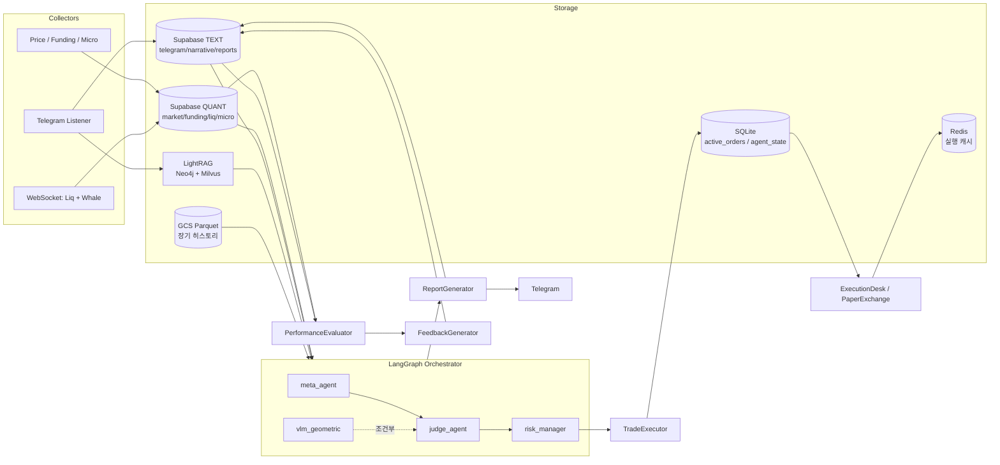

# Finance Telegram Bot — Architecture Reference

**Last updated: 2026-05-11 (V15.x)**
**Scope**: `scheduler.py`, `execution_main.py`, `executors/`, `agents/`, `collectors/`, `evaluators/`, `processors/`, `config/`, `bot/`, `liquidation_cascade/`, `cloud_jobs/`, `deploy/`, `mcp_server/`

> 코드 위치를 빠르게 찾기 위한 레퍼런스 문서.
> 섹션 번호로 먼저 탐색하고 해당 파일로 이동하세요.

---

## Table of Contents

1. [System Overview](#1-system-overview)
2. [Runtime Topology](#2-runtime-topology)
3. [AI Model Routing](#3-ai-model-routing)
4. [Data Layer](#4-data-layer)
5. [Scheduler Job Map](#5-scheduler-job-map)
6. [Cloud Run Jobs](#6-cloud-run-jobs)
7. [Infrastructure & Deployment](#7-infrastructure--deployment)
8. [Orchestrator (LangGraph)](#8-orchestrator-langgraph)
9. [Agent Layer](#9-agent-layer)
10. [Collector Layer](#10-collector-layer)
11. [Processor Layer](#11-processor-layer)
12. [Executor Layer](#12-executor-layer)
13. [Evaluator Layer](#13-evaluator-layer)
14. [Liquidation Cascade (ML)](#14-liquidation-cascade-ml)
15. [Telegram Bot & MCP Server](#15-telegram-bot--mcp-server)
16. [DB Table Reference](#16-db-table-reference)
17. [Key Configuration Parameters](#17-key-configuration-parameters)

---

## 1. System Overview

BTC/ETH 자동 분석·실행 봇. 14개 텔레그램 채널 + 파생상품/온체인 데이터를 LightRAG 지식 그래프로 통합하고, LangGraph 멀티에이전트 파이프라인으로 트레이딩 결정을 내린다.

| 항목 | 값 |
|------|-----|
| 심볼 | `BTCUSDT`, `ETHUSDT` (`settings.TRADING_SYMBOLS`) |
| 트레이딩 모드 | `SWING` (4h 분석 사이클, days~2주) |
| 스팟 모드 | `spot_swing` / `spot_position` (`SpotMode`) |
| AI 파이프라인 | Meta → Judge → Risk (LangGraph `StateGraph`) |
| 실행 | Paper-first 기본; Binance Futures / Upbit Spot |
| 평가 루프 | PerformanceEvaluator → FeedbackGenerator |
| 모니터링 | Prometheus metrics + Telegram 알림 |

---

## 2. Runtime Topology

프로세스는 **2개**로 분리된다.

```
scheduler.py           메인 프로세스 (APScheduler)
├── Telegram Bot         bot/telegram_bot.py        (daemon thread)
├── Telegram Listener    collectors/telegram_listener.py  (daemon thread)
├── WS Price Feed        collectors/ws_price_feed.py      (daemon thread)
├── WS User Stream       collectors/ws_user_stream.py     (daemon thread)
└── WebSocket Collector  collectors/websocket_collector.py (daemon thread)

execution_main.py      실행 전용 프로세스 (EXECUTION_PROCESS_SEPARATE=True)
└── 1min execution job, 8h funding fee job
```



---

## 3. AI Model Routing

`config/settings.py` — `MODEL_*` 필드가 단일 정책 테이블.

| 역할 | 모델 | 제공자 |
|------|------|--------|
| Judge / Self-correction | `gemini-2.5-pro` | Google AI Studio (Project A) |
| VLM / 차트 기하 분석 | `gemini-2.5-flash` | Google AI Studio (Project B) |
| Meta Regime 분류 | `qwen-3-235b-a22b-instruct-2507` | Cerebras |
| Risk Eval | `qwen-3-235b-a22b-instruct-2507` (fallback: Groq `qwen/qwen3-32b`) | Cerebras |
| RAG 추출 | `meta-llama/llama-4-scout-17b-16e-instruct` | Groq |
| 뉴스 요약 | `llama-3.1-8b-instant` | Groq |
| 뉴스 클러스터링 | `llama-3.3-70b-versatile` | Groq |
| 뉴스 최종 합성 | `openai/gpt-oss-120b` (fallback: `qwen/qwen3-32b`) | OpenRouter |
| 시장 모니터 (hourly) | `llama3.1-8b` | Cerebras |
| Perplexity 내러티브 | `sonar-pro` (targeted: `sonar`) | Perplexity |

---

## 4. Data Layer

### 4.1 Supabase — 2-Project Split

**파일**: `config/database.py` — `DatabaseClient` (싱글톤: `db`)

| 프로젝트 | 환경변수 | 저장 데이터 |
|---------|---------|------------|
| QUANT | `SUPABASE_URL_QUANT` / `SUPABASE_KEY_QUANT` | market, funding, cvd, liquidations, micro, deribit, fear_greed, macro |
| TEXT | `SUPABASE_URL_TEXT` / `SUPABASE_KEY_TEXT` | telegram, narrative, ai_reports, evaluations, trade_executions, feedback |

주요 조회 메서드:

| 메서드 | 테이블 | 용도 |
|--------|--------|------|
| `get_latest_market_data(symbol, limit)` | `market_data` | 1분봉 최근 N개 |
| `get_market_data_gap(symbol, since, limit)` | `market_data` | GCS 캐시 이후 갭만 fetch |
| `get_cvd_data(symbol, limit)` | `cvd_data` | CVD |
| `get_liquidation_data(symbol, limit)` | `liquidations` | 청산 데이터 |
| `get_latest_fear_greed()` | `fear_greed_index` | `{value, label}` |
| `get_latest_macro_data()` | `macro_data` | `{dgs10, dxy, nasdaq, ust_2s10s_spread}` |
| `get_funding_history(symbol, limit)` | `funding_rates` | funding rate DataFrame |
| `get_latest_narrative_data(symbol, source)` | `narrative_data` | 최신 퍼플렉시티 내러티브 |
| `cleanup_old_data()` | 다수 | 보존기간 초과 삭제 |

### 4.2 GCS Parquet — Long-term Archive

**파일**: `processors/gcs_parquet.py` — `GCSParquetStore` (싱글톤: `gcs_parquet_store`)
- 활성화: `ENABLE_GCS_ARCHIVE=True` + `GCS_ARCHIVE_BUCKET` 설정 시
- 비활성화 시에도 `_read_local_cache()` 경로(로컬 `cache/gcs_parquet/`)로 폴백

**데이터 로딩 원칙** (SWING 6개월 룩백):

```
1. gcs_parquet_store.load_ohlcv("1m", symbol, months_back)
   └── 로컬 캐시(cache/gcs_parquet/)에서 역사 데이터 로드

2. db.get_market_data_gap(symbol, since=last_cached_ts)
   └── 캐시 마지막 ts ~ 현재 갭만 Supabase에서 페이지네이션 fetch

3. pd.concat([df_cached, df_recent]).drop_duplicates()
```

### 4.3 LightRAG (Knowledge Graph)

**파일**: `processors/light_rag.py`
- Neo4j Aura: 핫 그래프 (엔티티 관계 / 코러보레이션 토폴로지)
- Zilliz/Milvus: 벡터 인덱스
- Cloudflare Workers AI `bge-reranker-base`: 경계 구간 크로스인코더 (dedup)
- 채널 가중치 없음 — 그래프 토폴로지(corroboration)가 중요도를 결정

### 4.4 Redis / SQLite

| 저장소 | 파일 | 용도 |
|--------|------|------|
| Redis | `utils/redis_client.py` | 실행 캐시, 속도 제한 |
| SQLite | `executors/agent_state_store.py` | AgentStateStore (스냅샷) |
| SQLite | `executors/execution_repository.py` | active_orders OMS |

---

## 5. Scheduler Job Map

**파일**: `scheduler.py`

| 주기 | 잡 ID | 주요 동작 |
|------|-------|----------|
| 매 1분 | `job_1min_tick` | price, funding, microstructure, volatility 수집 |
| 매 1분 | `job_1min_execution` | intent 처리, paper TP/SL 체크, 청산 모니터 (`execution_main.py`) |
| 매 5분 | `job_5m_ws_health` | WebSocket 스레드 생존 확인 + 재시작 |
| 매시 :15 | `job_hourly_monitor` | 시장 상태 소프트 트리거 모니터 |
| 매시 :20 | `job_routine_market_status` | market_status pressure 평가 |
| 매시 :45 | `job_1hour_evaluation` | PerformanceEvaluator 평가 사이클 |
| 1h | `job_1hour_deribit` | Deribit DVOL, PCR, IV Term, 25d Skew |
| 일 01:30/13:30 UTC | `job_daily_precision_symbol` (BTC) | LangGraph 전체 분석 |
| 일 01:40/13:40 UTC | `job_daily_precision_symbol` (ETH) | LangGraph 전체 분석 |
| 일 | `job_daily_fear_greed` | Fear & Greed Index 수집 |
| 일 | `job_daily_coinmetrics` | CoinMetrics 온체인 지표 수집 |
| 일 | `job_daily_archive_to_gcs` | GCS Parquet 아카이빙 |
| 일 | `job_daily_safe_cleanup` | 보존기간 초과 데이터 삭제 |
| 일 | `job_daily_refresh_higher_tf_cache` | 4h/1d/1w TF 캐시 갱신 |
| 트리거 | `job_snapshot_refresh_fast` | AgentState 스냅샷 빠른 갱신 |
| 트리거 | `job_snapshot_refresh_narrative` | AgentState 내러티브 갱신 |
| 트리거 | `job_liquidation_cascade_monitor` | ML 청산 캐스케이드 확률 계산 |

---

## 6. Cloud Run Jobs

**디렉토리**: `cloud_jobs/`
**진입점**: `cloud_jobs/entrypoint.py` — `JOB_NAME` 환경변수로 잡 선택
**배포**: `deploy/setup_cloud_run_jobs.sh` — Cloud Run Job 생성/업데이트 + Cloud Scheduler 트리거 연결

VM의 APScheduler와 달리 Cloud Scheduler가 각 잡을 독립 컨테이너로 실행한다. 잡 실패 시 최대 2회 재시도, 분석 잡은 메모리 2Gi/CPU 2 할당.

### 6.1 Data Collection Jobs

| 잡 이름 | Cloud Scheduler | 동작 |
|--------|----------------|------|
| `etf-flow` | 일 06:00 UTC | BTC/ETH ETF 자금 흐름 수집 |
| `stablecoin` | 일 06:15 UTC | USDT/USDC 공급량 수집 |
| `coinglass` | 6시간 주기 (:30) | Binance LSR + OI 수집 |
| `dune` | 매 15분 | Dune Analytics 온체인 수집 (비용 가드 적용) |

### 6.2 Analysis & RAG Jobs

| 잡 이름 | Cloud Scheduler | 동작 |
|--------|----------------|------|
| `telegram-batch` | 매시 :05 | Telegram → LightRAG ingest + triangulation |
| `crypto-news` | 매시 :10 | 외부 뉴스 → LightRAG ingest + Telegram 브리핑 |
| `market-status` | 매시 :20 | 시장 지표 요약 + Telegram 발송 |
| `snapshot-narrative` | 매시 :02, :32 | SWING 스냅샷 + Perplexity 내러티브 갱신 |
| `hourly-monitor` | 매시 :15 | 플레이북 기반 모니터 (2Gi/CPU 2) |
| `daily-precision-btcusdt` | 01:30, 13:30 UTC | BTCUSDT LangGraph 전체 분석 (2Gi/CPU 2, timeout 90분) |
| `daily-precision-ethusdt` | 01:40, 13:40 UTC | ETHUSDT LangGraph 전체 분석 (2Gi/CPU 2, timeout 90분) |

`daily_precision` 잡은 실행 전 GCS Parquet 캐시 동기화(`_bootstrap_parquet`) + CoinMetrics/Macro 수집(`_precision_prepare`)을 선행한다.

### 6.3 Evaluation Jobs

| 잡 이름 | Cloud Scheduler | 동작 |
|--------|----------------|------|
| `evaluation` | 매시 :45 | 에피소드 메모리 평가 → `evaluation_outcomes` |
| `evaluation-rollup` | 일 00:40 UTC | 일별 KPI 집계 → `evaluation_rollups_daily` |
| `evaluation-24h` | 일 00:30 UTC | 24시간 LLM 피드백 사이클 → `feedback_logs` |

---

## 7. Infrastructure & Deployment

**디렉토리**: `deploy/`

### 7.1 GCP Compute Engine

**파일**: `deploy/create_vm.sh`

| 항목 | 값 |
|------|-----|
| 리전 | `asia-southeast1` (싱가포르, 1순위) / `asia-east1` (대만) / `asia-northeast1` (도쿄) |
| 머신 타입 | `e2-medium` → `n1-standard-2` (가용 구역 순차 탐색) |
| OS | Ubuntu 22.04 LTS |
| 서비스 계정 | `crypto-trading-sa` (Secret Manager, Vertex AI, Cloud Logging, GCS) |
| SSH 접근 | Cloud IAP Tunnel 전용 (포트 22 직접 접근 차단) |

IAP 방화벽 규칙: `deny-ssh-internet` (priority 900) + `allow-ssh-iap` (priority 800, `35.235.240.0/20`).

### 7.2 Container Architecture

**파일**: `Dockerfile`, `docker-compose.yml`, `deploy/docker-compose.service`

VM 기동 시 `shared-data`, `shared-listener`, `shared-bot` 컨테이너가 자동 시작된다 (`systemd docker-compose.service`). 세 개의 systemd 서비스가 각 역할을 분리한다:

| 서비스 파일 | 역할 |
|------------|------|
| `deploy/scheduler.service` | `scheduler.py` — 분석·수집 메인 프로세스 |
| `deploy/execution.service` | `execution_main.py` — 실행 전용 프로세스 |
| `deploy/mcp_server.service` | FastMCP 서버 |

### 7.3 Blue-Green Deployment

**파일**: `deploy/blue_green_switch.sh`, `deploy/ci_deploy.sh`

트레이딩 봇은 일반 웹서버와 달리 **이중 주문(Double Execution)** 방지가 최우선이다.

```
1. 현재 이미지 → finance-bot:previous (롤백 스냅샷)
2. 신규 이미지 빌드 or Artifact Registry pull → finance-bot:latest
3. Green 환경 기동 (--profile shadow, Paper Trading 모드)
4. 30초 안정성 확인 → 컨테이너 크래시 시 자동 중단
5. SIGTERM → Blue Executor 종료 (진행 중인 Intent 마무리)
6. Green → Blue 승격 (AUTO_PROMOTE=1 시 무인 자동화)
```

롤백: `deploy/rollback.sh` — `finance-bot:previous`로 즉시 복구.

### 7.4 Secret Management

**파일**: `deploy/setup_secrets.sh`, `deploy/setup_github_secrets.sh`

모든 자격증명은 **GCP Secret Manager**에 저장된다. `.env` 파일은 프로덕션에서 사용하지 않는다. VM 기동 시 `USE_SECRET_MANAGER=true` 메타데이터로 Pydantic Settings가 Secret Manager에서 직접 로드한다.

### 7.5 Monitoring & Observability

| 도구 | 파일 | 용도 |
|------|------|------|
| Prometheus | `executors/metrics_logger.py` | `:9091/metrics` 노출 |
| Grafana Agent | `deploy/grafana_agent.yml` | Prometheus scrape → Grafana Cloud |
| Grafana Dashboard | `deploy/grafana_dashboard.json` | 실시간 거래 지표 시각화 |
| Smoke Test | `deploy/smoke_test.sh` | 배포 후 헬스체크 |

### 7.6 CI/CD

**파일**: `deploy/ci_deploy.sh`, `deploy/setup_github_runner.sh`

GitHub Actions → self-hosted runner (VM) 직접 배포. `AUTO_PROMOTE=1` 설정 시 `blue_green_switch.sh`가 무인으로 실행된다.

---

## 8. Orchestrator (LangGraph)

**파일**: `executors/orchestrator.py` — `LangGraph StateGraph`

```
collect_data
  → context_gathering
  → meta_agent          (Cerebras: 시장 레짐 분류)
  → triage              (VLM 투입 여부 결정)
  → generate_chart
  → rule_based_chart
  → vlm_expert          (조건부: 불확실/스트레스 구간만)
  → judge_agent         (Gemini: LONG/SHORT/HOLD + 승률/EV 계산)
  → risk_manager        (Cerebras: 포지션 사이징 / 리스크 예산)
  → execute_trade
  → generate_report
```

**게이트 조건** (deterministic, LLM 추가 호출 없음):

| 파라미터 | 기본값 | 의미 |
|---------|--------|------|
| `JUDGE_MIN_WIN_PROB_PCT` | 55.0% | 코인플립 초과 + 수수료 마진 |
| `JUDGE_MIN_RR_FOR_ENTRY` | 1.9 | `POLICY_MIN_RR=2.0` 허용 오차 |
| `JUDGE_MIN_EV_FOR_ENTRY_PCT` | 0.20% | 최소 기대 수익률 |

---

## 9. Agent Layer

**디렉토리**: `agents/`

| 파일 | 역할 | 모델 |
|------|------|------|
| `meta_agent.py` | 시장 레짐 분류, 컨텍스트 통합 | Cerebras `qwen-3-235b` |
| `judge_agent.py` | 최종 LONG/SHORT/HOLD 결정, 승률·EV 계산 | Gemini `gemini-2.5-pro` |
| `risk_manager_agent.py` | 포지션 사이징, 리스크 예산 배분 | Cerebras `qwen-3-235b` |
| `vlm_geometric_agent.py` | 차트 기하 패턴 분석 (조건부) | Gemini `gemini-2.5-flash` |
| `liquidity_agent.py` | 유동성 구조 분석 | Gemini |
| `macro_options_agent.py` | 매크로 + 옵션 시장 분석 | Gemini |
| `microstructure_agent.py` | 주문서 미시 구조 분석 | Gemini |
| `market_monitor_agent.py` | 시간별 소프트 트리거 모니터 | OpenRouter (무료 티어) |
| `emergency_replan_agent.py` | 포지션 보유 중 긴급 재계획 | Gemini |
| `ai_router.py` | 에이전트 라우팅 유틸 | — |

---

## 10. Collector Layer

**디렉토리**: `collectors/`

### 10.1 Telegram Channel Classification — 4-Tier

**파일**: `processors/telegram_batcher.py`

| 티어 | 채널 | 처리 방식 |
|------|------|----------|
| `BTC_ETH_ONCHAIN` | CryptoQuant, Glassnode, Lookonchain | 전량 LightRAG 인제스트 |
| `SMART_MONEY_FLOW` | Whale_Alert, Arkham_Alerter, DeFi_Million | 전량 LightRAG 인제스트 |
| `MARKET_INTELLIGENCE` | Wu_Blockchain, Unfolded, PeckShield | 전량 LightRAG 인제스트 |
| `BREAKING_FILTER` | WalterBloomberg, Tree_News, Watcher_Guru, Cointelegraph, Binance_Announcements | LLM 필터링 → `NO_BTC_ETH_SIGNAL` 시 인제스트 스킵 |

### 10.2 Market Data Collectors

| 파일 | 데이터 | 주기 |
|------|--------|------|
| `price_collector.py` | 1분봉 OHLCV, CVD | 1분 |
| `funding_collector.py` | Funding Rate | 1분 |
| `microstructure_collector.py` | 주문서 미시 구조 | 1분 |
| `volatility_monitor.py` | 변동성 지표 | 1분 |
| `websocket_collector.py` | 실시간 청산 + 웨일 거래 | 상시 WS |
| `ws_price_feed.py` | 실시간 가격 (주문 실행용) | 상시 WS |
| `ws_user_stream.py` | 체결 확인 User Data Stream | 상시 WS |
| `deribit_collector.py` | DVOL, PCR, IV Term, 25d Skew | 1시간 |
| `dune_collector.py` | 온체인/DEX 매크로 (월 2,500 크레딧 가드) | 15분 |
| `coinmetrics_collector.py` | 일별 온체인 레짐 오버레이 | 1일 |
| `fear_greed_collector.py` | Fear & Greed Index | 1일 |
| `macro_collector.py` | DGS10, DXY, NASDAQ, 2s10s spread (FRED) | 1일 |
| `perplexity_collector.py` | 시장 내러티브 검색 (200콜/일 쿼타, ~6콜/일 사용) | 분석 트리거 시 |
| `etf_flow_collector.py` | BTC/ETH ETF 자금 흐름 | 분석 트리거 시 |
| `coinglass_collector.py` | OI, OI Divergence, MFI Proxy | 분석 트리거 시 |
| `stablecoin_collector.py` | 스테이블코인 유통량 | 분석 트리거 시 |
| `crypto_news_collector.py` | 외부 크립토 뉴스 (URL + 본문) | 1시간 |

---

## 11. Processor Layer

**디렉토리**: `processors/`

| 파일 | 싱글톤 | 역할 |
|------|--------|------|
| `light_rag.py` | `light_rag` | LightRAG 인제스트·쿼리 (Neo4j + Milvus) |
| `gcs_parquet.py` | `gcs_parquet_store` | GCS Parquet 읽기/쓰기 |
| `gcs_archive.py` | `gcs_archive_exporter` | 일별 GCS 아카이빙 |
| `market_snapshot_builder.py` | — | 오케스트레이터용 종합 스냅샷 빌드 |
| `telegram_batcher.py` | — | 4-tier 채널 분류 + 배치 처리 |
| `chart_generator.py` | — | VLM용 캔들 차트 생성 |
| `onchain_signal_engine.py` | — | 온체인 시그널 정규화 |
| `flow_confirm_engine.py` | — | 자금 흐름 확인 |
| `math_engine.py` | `math_engine` | 기술 지표 계산 |
| `cvd_normalizer.py` | — | CVD 정규화 |
| `factor_ic_tracker.py` | — | 팩터 IC 추적 |
| `playbook_service.py` | — | 플레이북 룰 서비스 |
| `portfolio_optimizer.py` | — | 포트폴리오 최적화 |

---

## 12. Executor Layer

**디렉토리**: `executors/`

| 파일 | 싱글톤 | 역할 |
|------|--------|------|
| `orchestrator.py` | `orchestrator` | LangGraph 파이프라인 진입점 |
| `trade_executor.py` | `trade_executor` | Binance/Upbit 주문 실행 |
| `paper_exchange.py` | `paper_engine` | Paper Trading 엔진 |
| `order_manager.py` | `execution_desk` | OMS 주문 관리 |
| `execution_planner.py` | — | SMART_DCA 지정가 플래닝 |
| `execution_repository.py` | — | SQLite active_orders CRUD |
| `outbox_dispatcher.py` | — | 체결 확인 Outbox 패턴 |
| `risk_policy_engine.py` | — | 정책 헌법 (하드코딩 리스크 한도) |
| `risk_budget_controller.py` | — | 동적 리스크 예산 조율 |
| `agent_state_store.py` | `agent_state_store` | SQLite 에이전트 스냅샷 캐시 |
| `agent_snapshot_refresher.py` | — | 스냅샷 백그라운드 갱신 |
| `data_synthesizer.py` | — | 다중 소스 데이터 합성 |
| `report_generator.py` | `report_generator` | Telegram 분석 리포트 생성 |
| `report_hot_path.py` | — | 핫패스 리포트 (즉시 전송) |
| `cascade_warning_engine.py` | `cascade_warning_engine` | 청산 캐스케이드 경보 |
| `exchange_circuit_breaker.py` | — | 거래소 서킷브레이커 |
| `playbook_guard.py` | — | 플레이북 규칙 검증 |
| `gate_tuner.py` | — | 게이트 임계값 자동 조정 |
| `metrics_logger.py` | — | 실행 메트릭 로깅 |
| `performance_telemetry.py` | — | 성과 텔레메트리 |
| `post_mortem.py` | — | 트레이드 사후 분석 |
| `spot_orchestrator.py` | — | 스팟 전용 오케스트레이터 |
| `evaluator_daemon.py` | — | 평가 데몬 |
| `stats_thresholds.py` | — | 통계 임계값 계산 |

---

## 13. Evaluator Layer

**디렉토리**: `evaluators/`

| 파일 | 싱글톤 | 역할 |
|------|--------|------|
| `performance_evaluator.py` | `performance_evaluator` | 고정 호라이즌 결과 계산 → `evaluation_outcomes` |
| `feedback_generator.py` | `feedback_generator` | 오답 LLM 피드백 → `feedback_logs` |
| `evaluation_rollup.py` | `evaluation_rollup_service` | 일별 KPI 집계 → `evaluation_rollups_daily` |
| `trade_attribution_engine.py` | — | 트레이드 귀인 분석 |

---

## 14. Liquidation Cascade (ML)

**디렉토리**: `liquidation_cascade/`

청산 연쇄 반응 확률을 실시간으로 추정하는 ML 모듈.

| 파일 | 역할 |
|------|------|
| `model.py` | LightGBM 모델 정의 |
| `features.py` | 피처 엔지니어링 |
| `labels.py` | 레이블 생성 |
| `dataset.py` | 학습 데이터셋 빌더 |
| `inference.py` | 실시간 추론 |
| `schema.py` | 데이터 스키마 |

**확률 임계값** (`settings.py`):

| 단계 | 파라미터 | 기본값 |
|------|---------|--------|
| 주시 (WATCH) | `LIQUIDATION_CASCADE_WATCH_PROB` | 0.45 |
| 경고 (WARN) | `LIQUIDATION_CASCADE_WARN_PROB` | 0.60 |
| 확정 (CONFIRM) | `LIQUIDATION_CASCADE_CONFIRM_PROB` | 0.75 |

---

## 15. Telegram Bot & MCP Server

### 15.1 Telegram Bot

**파일**: `bot/telegram_bot.py`

`scheduler.py`에서 daemon 스레드로 기동. 주요 커맨드:

| 커맨드 | 동작 |
|--------|------|
| `/status` | 현재 포지션·잔고 조회 |
| `/analyze` | 즉시 분석 트리거 |
| `/report` | 최신 AI 리포트 조회 |
| `/mode` | SWING / POSITION 모드 확인 |

### 15.2 MCP Server

**파일**: `mcp_server/server.py`, `mcp_server/tools.py`
**프레임워크**: FastMCP
**배포**: `deploy/mcp_server.service` (systemd)

Claude Code 또는 외부 MCP 클라이언트에서 직접 봇 내부 데이터에 접근할 수 있는 인터페이스.

| MCP 툴 | 설명 |
|--------|------|
| `analyze_market(symbol)` | 멀티타임프레임 기술적 분석 실행 |
| `get_news_summary(hours)` | 텔레그램 채널 최근 N시간 뉴스 요약 |
| `get_funding_info(symbol)` | 펀딩률, OI, 롱숏 비율 + 컨텍스트 분석 |
| `get_global_oi(symbol)` | Binance+Bybit+OKX 거래소별 OI 합산 |
| `get_cvd(symbol, minutes)` | CVD (누적 볼륨 델타) — 기본 240분 |
| `query_knowledge_graph(query, mode)` | LightRAG 쿼리 (`local` / `global` / `hybrid`) |
| `get_latest_trading_report()` | 최신 AI 트레이딩 결정 리포트 |
| `get_current_position(symbol)` | 현재 포지션 상태 |
| `get_chart_image(symbol, lane)` | 차트 이미지 생성 (`swing` / `position` 레인) |
| `get_chart_images(symbol, lane)` | 분할 차트 이미지 (인간 가독 포맷) |
| `get_indicator_summary(symbol)` | 멀티타임프레임 기술 지표 요약 (컴팩트) |
| `get_trading_mode()` | 듀얼 모드 정책 설정 조회 |
| `execute_trade(symbol, side, amount, leverage)` | 직접 주문 실행 (`ENABLE_DIRECT_MCP_TRADING=True` 필요) |

---

## 16. DB Table Reference

### Supabase QUANT (수치 데이터)

| 테이블 | 주요 Writer | 보존 |
|--------|-----------|------|
| `market_data` | `price_collector` | 30일 |
| `cvd_data` | `price_collector`, `websocket_collector` | 30일 |
| `funding_rates` | `funding_collector` | 90일 |
| `liquidations` | `websocket_collector` | 30일 |
| `microstructure` | `microstructure_collector` | 30일 |
| `deribit_data` | `deribit_collector` | 90일 |
| `fear_greed_index` | `fear_greed_collector` | 365일 |
| `macro_data` | `macro_collector` | 365일 |

### Supabase TEXT (텍스트/AI 데이터)

| 테이블 | 주요 Writer | 보존 |
|--------|-----------|------|
| `telegram_messages` | `telegram_listener` | 30일 |
| `narrative_data` | `perplexity_collector` | 90일 |
| `ai_reports` | `report_generator` | 365일 |
| `trade_executions` | `trade_executor`, `paper_engine` | 365일 |
| `evaluation_outcomes` | `performance_evaluator` | 365일 |
| `evaluation_rollups_daily` | `evaluation_rollup_service` | 영구 |
| `feedback_logs` | `feedback_generator` | 365일 |

---

## 17. Key Configuration Parameters

**파일**: `config/settings.py` — `Settings` (Pydantic, `.env` 로드)

### 실행 안전

| 파라미터 | 기본값 | 설명 |
|---------|--------|------|
| `PAPER_TRADING_MODE` | `True` | 실주문 차단 (기본 안전 모드) |
| `MAX_LEVERAGE` | `3` | 최대 레버리지 |
| `MAX_ENTRY_DEVIATION_PCT` | `2.0%` | 분석가 대비 현재가 편차 한도 |
| `SMART_DCA_LIMIT_TTL_MINUTES` | `240` | 지정가 미체결 자동 취소 (4h) |
| `BINANCE_PAPER_BALANCE_USD` | `2,000` | 페이퍼 잔고 |

### 분석 캐던스

| 파라미터 | 기본값 | 설명 |
|---------|--------|------|
| `ANALYSIS_INTERVAL_HOURS` | `4` | SWING 분석 사이클 |
| `DAILY_PRECISION_HOURS_UTC` | `"1,13"` | 전체 LangGraph 실행 시각 (UTC) |
| `MONITOR_SOFT_TRIGGER_THRESHOLD` | `0.7` | 시장 모니터 소프트 트리거 임계값 |

### Dune API 비용 가드

| 파라미터 | 기본값 |
|---------|--------|
| `DUNE_GLOBAL_MIN_INTERVAL_MINUTES` | `60` |
| `DUNE_MAX_QUERY_RUNS_PER_DAY` | `24` |
| `DUNE_MAX_QUERIES_PER_RUN` | `5` |
