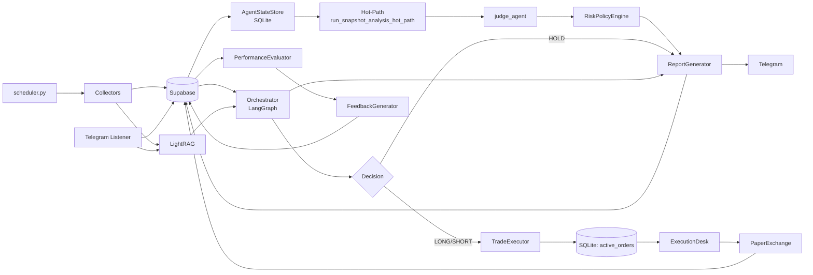

# 🌌 Finance Telegram Bot: Institutional-Grade AI Trader


[](https://www.python.org/)
[](#)
[](#)

An advanced, autonomous BTC/ETH trading system powered by multi-agent AI orchestration. Designed for high availability, risk management, and institutional-grade data analysis.

---

# 🏛️ Deep-Dive Architecture Reference

Last updated: 2026-03-19 (Milestone: V14.x)
Scope: `scheduler.py`, `executors/`, `agents/`, `collectors/`, `evaluators/`, `processors/`, `config/`, `bot/`, `liquidation_cascade/`

> **사용 목적**: 코드 위치를 빠르게 찾기 위한 레퍼런스.
> 기능·파일을 찾을 때 섹션 번호를 먼저 보고 해당 파일로 이동하면 됩니다.

---

## 목차

1. [시스템 개요](#1-시스템-개요)
2. [런타임 토폴로지](#2-런타임-토폴로지)
3. [데이터 레이어 (Supabase / GCS / SQLite)](#3-데이터-레이어)
4. [스케줄러 잡 맵](#4-스케줄러-잡-맵)
5. [오케스트레이터 (LangGraph 파이프라인)](#5-오케스트레이터)
6. [스냅샷 핫패스 (Hot-Path)](#6-스냅샷-핫패스)
7. [에이전트 레이어](#7-에이전트-레이어)
8. [컬렉터 레이어](#8-컬렉터-레이어)
9. [프로세서 레이어](#9-프로세서-레이어)
10. [익스큐터 레이어](#10-익스큐터-레이어)
11. [이벨류에이터 레이어](#11-이벨류에이터-레이어)
12. [리퀴데이션 캐스케이드 (ML)](#12-리퀴데이션-캐스케이드)
13. [텔레그램 봇](#13-텔레그램-봇)
14. [DB 테이블 전체 목록](#14-db-테이블-전체-목록)
15. [MCP 서버 툴](#15-mcp-서버-툴)
16. [설정 (settings.py) 핵심 파라미터](#16-설정-핵심-파라미터)

---

## 1. 시스템 개요

BTC/ETH 자동 분석·실행 봇.

| 구성요소 | 한 줄 설명 |
|---------|-----------|
| 심볼 | `BTCUSDT`, `ETHUSDT` (settings.TRADING_SYMBOLS) |
| 트레이딩 모드 | `swing` (6개월 룩백, 4h 분석) / `position` (4년 룩백, 1d 분석) |
| 데이터 수집 | 1분봉·파생상품·온체인·텔레그램 실시간 |
| AI 분석 | Meta → Judge → Risk (LangGraph) |
| 실행 | Paper-first, Binance Futures / Upbit Spot |
| 평가 루프 | PerformanceEvaluator → FeedbackGenerator |

---

## 2. 런타임 토폴로지

```
scheduler.py (APScheduler)
├── 텔레그램 봇 스레드          bot/telegram_bot.py
├── 텔레그램 리스너 스레드       collectors/telegram_listener.py
└── Binance WebSocket 스레드   collectors/websocket_collector.py
```



---

## 3. 데이터 레이어

### 3.1 Supabase (핫 운영 데이터)

- **파일**: `config/database.py` — `DatabaseClient` 클래스
- 싱글톤: `db = DatabaseClient()` (모듈 하단)
- 핵심 메서드:

| 메서드 | 테이블 | 용도 |
|-------|-------|------|
| `get_latest_market_data(symbol, limit)` | `market_data` | 1분봉 최근 N개 |
| `get_market_data_gap(symbol, since, limit)` | `market_data` | GCS 캐시 이후 갭만 fetch |
| `get_cvd_data(symbol, limit)` | `cvd_data` | CVD 데이터 |
| `get_liquidation_data(symbol, limit)` | `liquidations` | 청산 데이터 |
| `get_market_data_since(symbol, since, limit=120)` | `market_data` | 소량 조회 전용 |
| `cleanup_old_data()` | 다수 | 보존기간 초과 삭제 |

### 3.2 GCS Parquet (장기 히스토리 스토어)

- **파일**: `processors/gcs_parquet.py` — `GCSParquetStore` 클래스
- 싱글톤: `gcs_parquet_store = GCSParquetStore()`
- 활성화: `settings.ENABLE_GCS_ARCHIVE=True` + `settings.GCS_ARCHIVE_BUCKET` 설정 시
- **GCS 비활성화 시에도 `_read_local_cache()` 경로로 VM 로컬 파일 읽기 가능**

**데이터 로딩 원칙 (Swing 6개월 / Position 4년)**:

```
1. gcs_parquet_store.load_ohlcv("1m", symbol, months_back)
   → 로컬 캐시(cache/gcs_parquet/)에서 역사 데이터 로드

2. db.get_market_data_gap(symbol, since=last_cached_ts)
   → 캐시 마지막 ts ~ 현재 갭만 Supabase에서 페이지네이션 fetch

3. pd.concat([df_cached, df_recent]).drop_duplicates()
```

---

## 4. 스케줄러 잡 맵

**파일**: `scheduler.py`

| 주기 | 잡 이름 | 주요 동작 |
|------|---------|----------|
| 매 1분 | `job_1min_tick` | price, funding, microstructure, volatility |
| 매 1분 | `job_1min_execution` | intent processing, paper TP/SL, 청산 체크 |
| 매 5분 | wsocket health check | WebSocket 스레드 자동 재시작 |
| 매시 :45 | `job_1hour_evaluation` | 평가 사이클 실행 |
| 일 01:00 UTC | `job_daily_archive_to_gcs` | GCS Parquet 아카이빙 |

*(중략 - 상세 내용은 AGENTS_ARCHITECTURE.md와 동일)*

---

## 11. 이벨류에이터 레이어

| 파일 | 싱글톤 | 역할 |
|-----|-------|------|
| `evaluators/performance_evaluator.py` | `performance_evaluator` | 고정-호라이즌 결과 계산 → `evaluation_outcomes` |
| `evaluators/feedback_generator.py` | `feedback_generator` | 오답 LLM 피드백 → `feedback_logs` |
| `evaluators/evaluation_rollup.py` | `evaluation_rollup_service` | 일별 KPI 집계 → `evaluation_rollups_daily` |

---

## 14. DB 테이블 전체 목록

### Supabase (Postgres)

| 테이블 | 주요 Writer | 보존 |
|-------|-----------|------|
| `market_data` | price_collector | 30일 |
| `cvd_data` | price_collector, websocket_collector | 30일 |
| `ai_reports` | report_generator | 365일 |

---

## 15. MCP 서버 툴

| 툴 | 설명 |
|----|------|
| `analyze_market(symbol)` | 핫패스 분석 실행 |
| `get_news_summary(hours=4)` | 최근 뉴스 요약 |

---

*(최종 상세 내역은 저장소의 AGENTS_ARCHITECTURE.md를 참조하세요)*

---

